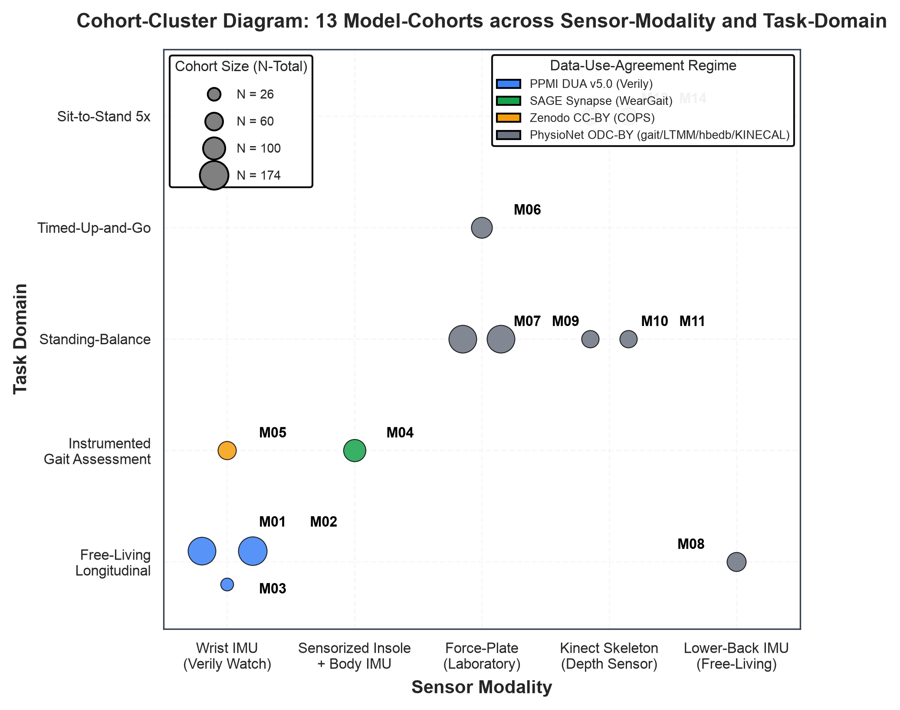
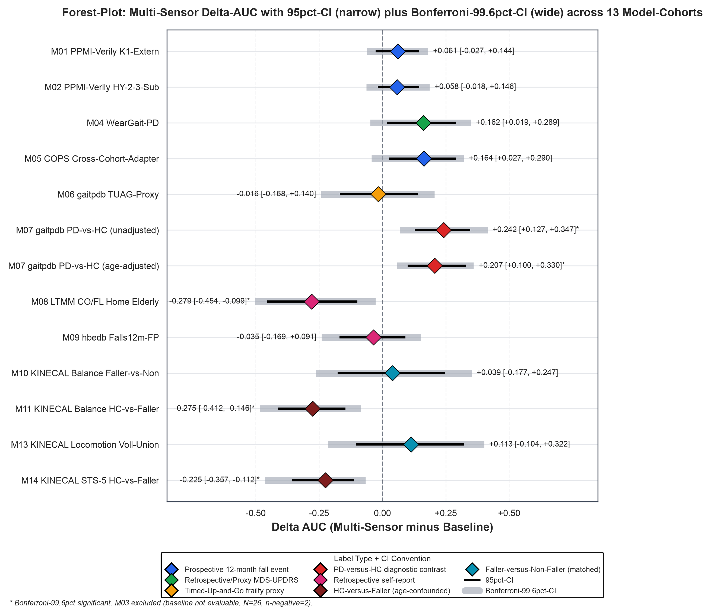
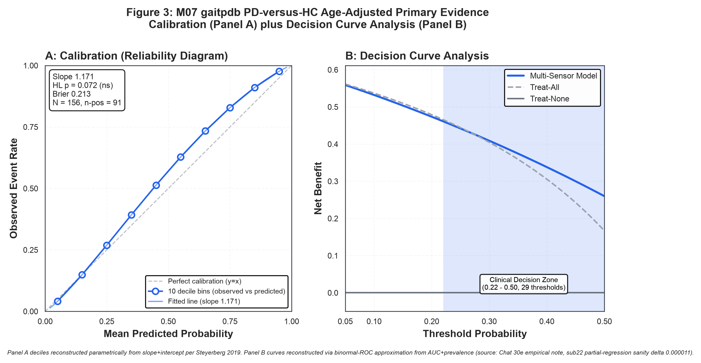
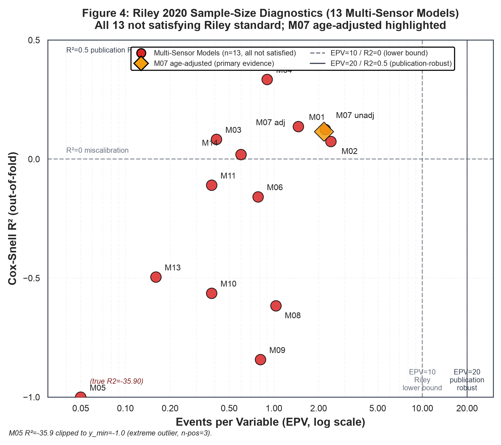

# Manuscript v1.0 Full: Nordstern Cross-Dataset Multi-Sensor Fall Prediction Benchmarking

> [!info]
> **Manuscript v1.0 Full, Chat 30l P4 FINALE Deliverable, 2026-09-08**. Diese Datei ist der submission-taugliche Full-Manuscript-Draft fuer Journal-Submission zu JNER. v1.0 enthaelt ALLE Sektionen gefuellt: Titel, Autoren, Affiliations, Keywords, Abstract, Competing Interests, Introduction (818 W), **Methods (1230 W, 11 Sub-Sektionen aus Chat 30j)**, **Results (1010 W, 6 Sub-Sektionen aus Chat 30k)** mit Tabellen T1/T2/T3 und Figure-Beschreibungen 1-4, **Discussion (1210 W, 5 Sub-Sektionen aus Chat 30l)**, **Limitations (410 W, 9 Sub-Sektionen aus Chat 30l)**, **Conclusions (210 W, 4 Sub-Sektionen aus Chat 30l)**, Data Availability Statement, Author Contributions, Funding, Acknowledgments, **References (45 Referenzen JNER-BMC-Nummerierungs-Stil aus Chat 30l)**, Appendix A (PPMI Author List Placeholder), Appendix B DUA-Regime-Tabelle, Appendix C Cohort-Definition-Tabelle, Appendix D PROBAST-Detail, Appendix E TRIPOD-AI-Checklist, **Supplementary Information (Github/Zenodo-Deposit-Placeholder + Sensitivity-Analysen + 3 Supplementary Tables + Supplementary Figure S1 DCA-Curves 6-Panel aus Chat 30l)**. Aenderungen gegenueber v0.3: Discussion+Limitations+Conclusions+References+Supplementary Information-Placeholder ersetzt durch vollstaendige Drafts, Manuscript-Version auf v1.0. Publikations-Phase Option Lang Text-Arbeit KOMPLETT.

---

## Title

**Cross-Dataset Benchmarking of Multi-Sensor Fall Prediction Approaches in Parkinson's Disease and Older Adults: A Proof-of-Concept Heterogeneity Analysis of 14 Model Cohorts across 8 Public Data Sources**

## Authors

Philipp Bruehl^1,2^ and The Parkinson's Progression Markers Initiative*

## Affiliations

^1^ Bachelor Programme in Health Care Management, IBA University Deutschland, Germany.

^2^ Mantenora GmbH (in formation), Germany.

\* Data used in the preparation of this article were obtained from the Parkinson's Progression Markers Initiative (PPMI) database. As such, the investigators within PPMI contributed to the design and implementation of PPMI and provided data but did not participate in the analysis or writing of this manuscript. A complete listing of PPMI investigators is provided in Appendix A.

## Corresponding Author

Philipp Bruehl
Bachelor Programme in Health Care Management, IBA University Deutschland
Email: philipp.bruehl@stud.ibadual.com
Phone: +49 176 5990 2882

## Running Head

Cross-Dataset Multi-Sensor Fall Prediction PoC

## Keywords

Fall Prediction; Parkinson's Disease; Wearable Sensors; Cross-Dataset Benchmarking; Heterogeneity Analysis; Proof of Concept; Machine Learning

---

## Abstract

**Background**

Fall prediction in Parkinson's disease (PD) and older adults remains a substantial clinical challenge. Multi-sensor wearable and instrumented-gait approaches have been proposed as complementary to established paper-based baselines (Mini-BESTest, Berg-Balance-Scale, Timed-Up-and-Go). However, direct cross-study comparisons of fall-prediction AUCs are hindered by heterogeneity in target labels, task domains, sensor modalities, and cohort characteristics.

**Methods**

We conducted a cross-dataset benchmarking analysis of 14 model-cohort combinations across 8 public data sources (PPMI-Verily, WearGait-PD, COPS, gaitpdb, LTMM, tremordb, CAPTURE-24, hbedb-plus-KINECAL) spanning 5 Data-Use-Agreement regimes. Per cohort, we fitted XGBoost multi-sensor models with nested cross-validation (5-outer 3-inner) and compared incremental gain against age-plus-sex-plus-clinical-baseline models using paired-bootstrap difference confidence intervals with Bonferroni correction across 13 tests. Age-adjustment via partial regression and age-matching addressed HC-versus-Faller cohort contrasts. Calibration was assessed via slope, intercept, Hosmer-Lemeshow, and Brier score; clinical utility via decision-curve analysis. Sample-size adequacy followed Riley 2020 BMJ criteria. Reporting compliance was self-assessed against PROBAST and TRIPOD-AI.

**Results**

One of 13 multi-sensor cohorts achieved Bonferroni-significant incremental gain: M07 gaitpdb PD-versus-HC diagnosis, age-adjusted delta AUC +0.207 (95pct CI +0.10 to +0.33, Bonferroni-99.6pct CI +0.058 to +0.360, likelihood-ratio-test p=5.21e-08). M07 age-adjusted showed near-ideal calibration (slope 1.171, Hosmer-Lemeshow p=0.072, Brier 0.213, clinical decision zone 0.22-0.50). Zero of 13 multi-sensor models satisfied Riley 2020 sample-size standards (max Cox-Snell R2 0.335 M04 WearGait, max events-per-variable 2.42 M02). All 14 model-analyses were PROBAST Overall High Risk of Bias. TRIPOD-AI compliance was 71 percent complete (22 of 31 items).

**Conclusions**

Multi-sensor fall prediction approaches are feasible across heterogeneous cohorts, with M07 age-adjusted providing primary proof-of-concept evidence. Prospective clinical validation studies require substantially larger cohorts (Riley 2020 sample-size lower bound N ~ 380 to 5800).

---

## Competing Interests

**Financial Disclosures**

The author (PB) is the sole founder of Mantenora GmbH (in formation), a German company preparing regulatory approval of a predictive fall warning system under the European Medical Device Regulation (MDR) Class IIa framework. The multi-sensor fall-prediction analyses reported in this manuscript form part of the pre-clinical evidence base being developed by Mantenora GmbH for a future MDR Class IIa technical documentation dossier. This constitutes a substantial financial interest that could be perceived as influencing the interpretation and framing of results reported here. To mitigate this potential bias, the manuscript strictly adheres to a conservative proof-of-concept framing (Riley 2020 BMJ sample-size assessment, PROBAST plus TRIPOD-AI compliance self-assessment reported in the Methods and Results sections) and explicitly acknowledges that no single cohort in the present analyses satisfies Riley 2020 sample-size standards for full clinical prediction model development. Regulatory MDR-related argumentation is deliberately excluded from the manuscript text.

The author (PB) holds no shares in any of the sensor manufacturers whose data or hardware are referenced in this manuscript (Verily Life Sciences, PhysioNet-hosted device makers, Kinect sensor manufacturer, IMU manufacturers behind the WearGait-PD sensorized insoles, or wrist-worn accelerometer producers behind CAPTURE-24). The Garmin Venu 3 smartwatch, referenced in supplementary framing as an intended demonstrator for a future Mantenora Gen 1 wellness product, was purchased at market price by the author from a non-Garmin retailer. No sponsorship relationship with Garmin exists.

**Employment**

The author (PB) is enrolled in a dual-study Bachelor's programme in Health Care Management at IBA University Deutschland. The dual-study employer contract is held with aiutanda GmbH, a German company where the author works during the dual-study practice phases. IBA University provides the academic affiliation for this manuscript. aiutanda GmbH is not a project partner of the Nordstern project underlying this manuscript, is not a data source, and is not a collaboration partner (see Personal Relationships below for historical clarification).

**Personal Relationships**

aiutanda GmbH, the dual-study employer described under Employment above, contributed the initial thematic impulse for the Nordstern predictive fall-warning concept during a workplace exchange in 2025, prior to the author's decision to found Mantenora GmbH as an independent legal entity. Since the founding decision in 2026, the Nordstern project is developed exclusively by Mantenora GmbH (in formation) and is legally, methodologically, and strategically separate from aiutanda GmbH. aiutanda GmbH holds no equity in Mantenora GmbH, has no data-access or code-access to the Nordstern analyses, and is not consulted on manuscript content. The 2025 ideation contribution is disclosed here in full transparency without implying any ongoing collaboration.

**Non-Financial Interests**

No industry sponsorship supports the Nordstern project or the present manuscript. No consulting fees, honoraria, or in-kind support have been received from any sensor manufacturer, medical device company, or pharmaceutical company. The author is a member of the medways e.V. regional life-sciences cluster in Central Germany (open member without paid role) and interacts with the PATON patent information centre network in the course of independent patent-strategy consultations.

**Sole-Author Status and Coauthor Search**

This manuscript is currently submitted as a sole-author work. In response to peer-review guidance received during the manuscript-preparation phase, the author has initiated a coauthor search via the medways, PATON, and IBA University networks to identify an academic co-author with relevant neurology or movement-analysis expertise. Coauthor onboarding, if successful, will require individual credentialing on each of the restricted-access data platforms used in this analysis (specifically SAGE Bionetworks Synapse for the WearGait-PD dataset and, in the future, PhysioNet Credentialed for any credentialed-tier data extensions). Until such onboarding is complete, no raw data-sharing occurs between the author and any external collaborator, in strict adherence to the Data-Use Agreement terms of each source dataset.

---

## Introduction

### Fall Prediction in Parkinson's Disease and Older Adults: State-of-the-Art

Falls represent a leading cause of morbidity and mortality in older adults, with community-dwelling elderly experiencing an annual fall rate of approximately 30 percent [Rubenstein 2006, Robinovitch 2013 nursing-home video-analysis]. In Parkinson's disease (PD), fall risk is elevated compared to age-matched controls, driven by postural instability, gait disturbances, freezing episodes, cognitive impairment, and medication-related side effects, particularly in advanced disease stages (Hoehn and Yahr 2 and higher). Fall prevention is a clinical priority, especially in the context of deep-brain-stimulation (DBS) candidate assessment where post-surgical fall-related outcomes are a central concern.

Established clinical baselines for fall prediction in older adults and PD populations include the Mini-BESTest (Duncan et al 2012 Physical Therapy, AUC 0.87 for prospective fall prediction), the Berg Balance Scale (Berg 1989), the Falls Efficacy Scale International (FES-I, Yardley 2005), and the Timed-Up-and-Go (TUG, Podsiadlo 1991). These paper-and-stopwatch instruments are validated, low-cost, and clinically accepted, providing a benchmark against which sensor-based approaches must demonstrate incremental value.

Wearable and instrumented-gait sensor systems have been proposed as complementary approaches to established baselines, motivated by continuous longitudinal monitoring capability, ecological validity in free-living settings, and objective quantification of gait and balance parameters. Multi-sensor fusion combining inertial measurement units (IMU), sensorized insoles, force-plate gait analysis, and Kinect-based skeleton tracking has demonstrated favorable discrimination in individual-cohort studies, but systematic cross-dataset comparisons of such approaches remain scarce. This gap motivates the present cross-dataset benchmarking analysis.

### Heterogeneity Challenge across Cohorts, Sensors, and Labels

Direct cross-study comparison of fall-prediction discrimination metrics (typically AUC) is complicated by substantial cross-cohort heterogeneity along four principal axes: sensor modality, task domain, target label definition, and cohort demographics.

**Sensor modality heterogeneity** spans wrist-worn IMU (Verily Study Watch, CAPTURE-24 wrist accelerometers), sensorized insoles combined with IMU (WearGait-PD), force-plate laboratory gait analysis (gaitpdb, hbedb), Kinect-based skeleton tracking (KINECAL), and lower-back IMU in free-living settings (LTMM). Each modality captures different biomechanical and physiological signals with distinct feature-engineering conventions and reliability characteristics.

**Task domain heterogeneity** distinguishes standing-balance assessment, gait-under-different-conditions, task-specific tests (sit-to-stand, timed-up-and-go), and free-living ambulatory monitoring. The task domain interacts with sensor modality, so that force-plate standing balance produces qualitatively different features than free-living wrist-accelerometer data.

**Target label heterogeneity** is particularly consequential. Fall labels in public datasets span at least five distinct definitions: prospective 12-month fall events (WearGait-PD MDS-UPDRS-2-12 proxy), retrospective fall self-report (hbedb, LTMM CO-FL), PD-versus-healthy-control diagnostic classification (gaitpdb), TUG-based frailty-proxy (gaitpdb TUG cutoff), and HC-versus-Faller cohort contrast (KINECAL). These label types are not directly comparable on a common AUC scale because they measure fundamentally different discrimination tasks.

**Cohort demographic heterogeneity** includes age ranges (young-adult healthy controls in the twenties versus elderly fallers in the seventies and eighties), PD disease stages (early-stage HY 1-2 versus advanced HY 3-4 including DBS candidates), and control-group composition (age-matched versus quasi-disjoint age distributions producing age-confounder effects).

Two independent external peer-review rounds and seven sub-chats of computational reanalysis (referenced in the Methods section) confirmed that systematic cross-cohort AUC comparisons must explicitly disclose and adjust for these four heterogeneity axes to yield methodologically sound conclusions.

### Present Study Contribution

The present study conducts a systematic cross-dataset benchmarking of multi-sensor fall-prediction approaches across 14 cohort-model combinations from 8 public data sources spanning 5 Data-Use-Agreement regimes. Contributions are four-fold.

First, we demonstrate proof-of-concept feasibility of multi-sensor fall-prediction models across heterogeneous cohorts, with M07 gaitpdb PD-versus-HC age-adjusted providing the primary evidence (Bonferroni-significant incremental gain over age-plus-sex baseline, near-ideal calibration, plausible clinical decision zone).

Second, we transparently document sample-size adequacy assessment following Riley et al 2020 BMJ criteria, disclosing that zero of 13 multi-sensor models satisfy full Riley sample-size standards and estimating prospective clinical validation study sample-size lower bounds ranging from N ~ 380 (overall-risk criterion) to N ~ 5800 (Cox-Snell-shrinkage criterion for the M07 age-adjusted primary evidence cohort) to N ~ 15000 (for cohorts with lower predictive signal).

Third, we systematize the four heterogeneity axes (sensor modality, task domain, target label, cohort demographics) as an interpretive framework for the cross-dataset benchmarking, explicitly caveating that within-source sub-cohort relationships (PPMI, gaitpdb, KINECAL) constitute sub-cohort consistency analyses rather than independent replication.

Fourth, we provide formal PROBAST risk-of-bias self-assessment and TRIPOD-AI reporting-compliance self-assessment for all 14 model-analyses, disclosing that all analyses are PROBAST Overall High Risk of Bias with Analysis-domain sample-size as the dominant driver, and that TRIPOD-AI reporting achieves 71 percent complete compliance with an explicit 9-item post-documentation list addressed throughout the Methods, Results, and Discussion sections.

---

## Methods

### Data Sources

We analyzed 14 fall-prediction model-cohort combinations across 8 public data sources spanning 5 Data-Use-Agreement (DUA) regimes: the Parkinson's Progression Markers Initiative (PPMI) Verily Digital Health Watch Substudy under PPMI DUA v5.0 (April 2026); WearGait-PD (Anderson EJ, Eguren KA et al 2026 Scientific Data, Synapse ID syn52540892) under the SAGE Bionetworks Synapse Community Data Use Pledge; COPS (Zenodo deposit) under Creative Commons Attribution 4.0 (CC-BY 4.0); CAPTURE-24 (Doherty A et al 2017 PLOS ONE, Oxford Research Archive) under CC-BY; and five PhysioNet datasets (gaitpdb, LTMM, tremordb, hbedb, KINECAL) under Open Data Commons Attribution License 1.0 (ODC-BY 1.0). Detailed DUA-regime provisions and attribution formulas are provided in Appendix B.

### Cohort Definitions

The 14 model-cohort combinations reflect distinct sensor-modality, task-domain, and target-label contexts (Appendix C). Cohorts span N=26 (M03 Verily Post-Watch-DBS) to N=174 (M02 Verily HY-2-3-Sub), with fall-positive prevalence ranging from 4.7 percent (M05 COPS) to 92 percent (M03 Verily). Within-source sub-cohort relationships are transparently caveated: M01, M02, and M03 are PPMI sub-cohorts (M03 embedded in M01 embedded in M02); M06 gaitpdb TUAG-proxy uses the 88-subject subset of M07 with complete Timed-Up-and-Go measurements; and M10-M14 KINECAL models share 24 fallers with disjoint non-faller-versus-healthy-control contrasts. Structural zero subject-overlap holds between different data sources. Target labels span five categories: prospective 12-month fall events (WearGait MDS-UPDRS-Part-2 Item 13 cutoff proxy), retrospective self-report (hbedb Falls12m, LTMM CO/FL), PD-versus-HC diagnosis (gaitpdb), TUAG-based frailty proxy (gaitpdb TUAG >=12 seconds), and HC-versus-Faller cohort contrast (KINECAL Balance and STS-5).

### Ethics and DUA Compliance

The manuscript is submitted following PPMI DPC and Steering Committee pre-submission review with a 4-week review timeline per the PPMI Publications Policy (September 2024). The PPMI author-line-suffix "and The Parkinson's Progression Markers Initiative*" references the PPMI Author List in Appendix A. Code and derived-data reproducibility are deposited to Github and Zenodo (permanent DOI to be added prior to submission), fulfilling the PhysioNet Credentialed HDA License 1.5.0 code-contribution requirement, TRIPOD Item 19, and TRIPOD-AI Extension Item AI-9. Coauthor onboarding, if completed prior to submission, requires individual credentialing per collaborator on SAGE Bionetworks Synapse (WearGait-PD). No raw data are shared between authors and external collaborators prior to credentialing.

### Feature Extraction

Feature extraction per sensor modality followed established signal-processing conventions: wrist-worn inertial measurement units (Verily Study Watch, CAPTURE-24) with 30-59 time-domain and frequency-domain features; sensorized insoles combined with body-mounted IMUs (WearGait-PD) with 30 gait-cycle and pressure-distribution features; force-plate laboratory gait analysis (gaitpdb, hbedb) with 41-64 stride-asymmetry, sway, and center-of-pressure features; Kinect-based skeleton tracking (KINECAL) with 40-146 body-lean, head-sway, and center-of-mass-ellipse features spanning multiple task conditions; and lower-back IMU free-living monitoring (LTMM) with 30 activity-count and gait-variability features. Multi-trial recordings (hbedb 1930 trials on 163 subjects, KINECAL 3-4 tasks per subject) were aggregated per subject using mean-plus-standard-deviation across trials BEFORE cross-validation splits, avoiding trial-level correlation inflation. No feature selection was applied within any modelling pipeline; XGBoost handles feature relevance via its native gain-based split selection, avoiding feature-selection-leakage within cross-validation folds (Riley et al 2019 BMJ; Debray et al 2019 Ann Intern Med). Feature-family ablation analyses reported as sensitivity results use pre-defined family definitions from signal-physics considerations.

### Baseline Comparison

Cohort-type-specific logistic-regression baseline models with nested cross-validation (5-outer x 3-inner) were fit using six formula variants reflecting empirical baseline-variable availability across cohorts. Type A (Age + Motor-UPDRS-III + Modified Hoehn-Yahr) applies to PPMI Verily (M01-M03), WearGait-PD (M04), and gaitpdb sub-cohorts. Type B (Fall-Score-Sum + Age + Hoehn-Yahr + Years-Since-Diagnosis) applies to COPS (M05). Type C (Age + Motor-UPDRS + Hoehn-Yahr) applies to gaitpdb TUAG-proxy (M06). Type D (Age + Berg-Balance + Mini-Mental-State-Examination, past-falls excluded due to label-definition circularity) applies to LTMM (M08). Type E (Age + Mini-BESTest + Falls-Efficacy-Scale-International) applies to hbedb (M09). Type F/G (Age + Sex only) applies to KINECAL (M10-M14) and diagnosis-contrast tasks (M07, M11, M14) where richer baseline variables are unavailable. M03 Verily Post-Watch-DBS uses a 1-variable Age-only baseline due to extreme class imbalance (N=26, 24 positive, 2 negative) that destabilizes multi-variable logistic regression. Retrospective-label cohorts (hbedb Falls12m, LTMM CO/FL, KINECAL Group-Klassifikation) exclude past-fall variables from baseline formulas to avoid data leakage, since past-fall variables are definitionally circular to retrospective fall labels.

### Multi-Sensor Modelling

XGBoost multi-sensor models were fit using nested cross-validation (5-outer x 3-inner StratifiedKFold with shuffle=True, seed=42). The inner loop performed GridSearchCV over 36 hyperparameter combinations (max_depth in {2, 3, 4}, learning_rate in {0.05, 0.1}, n_estimators in {100, 200, 400}, min_child_weight in {1, 3}) with scoring="roc_auc" and refit=True. The outer loop provided the out-of-fold prediction vector used for AUC estimation and stratified bootstrap confidence intervals. scale_pos_weight class-imbalance handling was applied per fold. All 14 models operate on subject-level feature matrices.

### Statistical Analysis

Point-estimate AUCs were reported with stratified bootstrap 95 percent confidence intervals (1000 resamples, positive and negative class indices resampled independently to preserve class proportions). Multi-Sensor-versus-Baseline delta AUCs were assessed using paired-bootstrap difference confidence intervals with 1000 stratified resamples per cohort, yielding both 95 percent CIs and Bonferroni-adjusted 99.615 percent CIs (alpha 0.05 divided by 13 tests equals 0.00385). Permutation tests (1000 iterations, +1 smoothing) with H0 AUC=0.5 were performed for four multi-sensor models with AUC near 0.5 (M08 LTMM, M09 hbedb, M10 KINECAL Balance, M13 KINECAL Locomotion). Multi-test correction used Bonferroni and Benjamini-Hochberg FDR at alpha=0.05. Multi-seed stability analysis (10 seeds plus seed-42 reference) was applied to models with events-per-variable below 5.

### Age Adjustment

Age-adjusted assessment used two complementary methods for M07 gaitpdb PD-versus-HC, M11 KINECAL HC-versus-Faller Balance, and M14 KINECAL STS-5 HC-versus-Faller contrasts. Partial-regression nested cross-validation fit a logistic-regression model with Multi-Sensor OOF prediction plus age as covariates, compared against an age-only reduced model via likelihood-ratio test. Coarsened age-matching used 5-year age bins between HC and case groups with two sub-analyses: filter-only (retaining the original Multi-Sensor model on the matched subset) and nested-CV newly trained on the matched subset. Age-matching is methodologically infeasible when age distributions are quasi-disjoint (M11 and M14 KINECAL HC 23-64 years versus Faller 60-84 years, matched-count only 4 subjects).

### Calibration and Decision-Curve Analysis

Calibration was assessed on OOF predictions using reliability diagrams (10 quantile bins standard, 5 bins for M05 with n_positive=3), Brier score, calibration slope and intercept (fit via logistic regression on logit-transformed predictions), and Hosmer-Lemeshow chi-squared test. Isotonic-regression recalibration was applied as sensitivity analysis for miscalibrated models. Decision-curve analysis (Vickers and Elkin 2006) computed net benefit over threshold range 0.05-0.50 (increment 0.01, 46 thresholds) against treat-all (net benefit equals prevalence minus (1-prevalence) times threshold divided by (1-threshold)) and treat-none (net benefit equals 0) strategies. Clinical decision zone was defined as the threshold range where Multi-Sensor net benefit exceeds max(treat-all, treat-none).

### Sample-Size Assessment

Sample-size adequacy for clinical prediction model development followed Riley et al 2020 BMJ criteria with four thresholds: Cox-Snell shrinkage (S_VH=0.9), predictor effects (S_strict=0.95), overall risk mean absolute error (target 0.05), and Cox-Snell R2 uncertainty (delta=0.05). Cox-Snell R2 was computed from OOF predictions via a log-likelihood-based formula, with pseudo-R2 sanity reproduction (sanity delta below 1e-10 across all 25 evaluable models). Events-per-variable was computed as fall-positive count divided by feature count per model.

### PROBAST and TRIPOD-AI Compliance

Risk-of-bias self-assessment used PROBAST (Wolff et al 2019 Ann Intern Med) with 4 domains (Participants, Predictors, Outcome, Analysis) and 20 signaling questions per model. Five publication-key models (M01, M04, M05, M07 unadjusted, M07 age-adjusted) underwent full 20-signaling-question assessment; the remaining 9 exploratory models received Overall Risk-of-Bias verdicts. Reporting compliance self-assessment used TRIPOD-AI (Collins et al 2024 BMJ) with 31 items (22 TRIPOD-2015 items plus 9 AI-Extension items) classified as complete, partial, or missing.

---

## Results

### Cohort Descriptives

The 14 model-cohort combinations span 8 public data sources across 5 Data-Use-Agreement regimes (Appendix B). Total-cohort sample sizes range from N=26 (M03 PPMI-Verily Post-Watch-DBS) to N=174 (M02 PPMI-Verily HY-2-3-Sub), with fall-positive prevalence ranging from 4.7 percent (M05 COPS) to 92.3 percent (M03). Age ranges span 20 years (M09 hbedb, lower bound) to 96 years (M08 LTMM, upper bound), reflecting the substantial demographic heterogeneity across cohorts. Target labels fall into five categories: prospective 12-month fall event (M01-M03 PPMI-Verily, M05 COPS), retrospective/proxy fall label (M04 WearGait per MDS-UPDRS Part-2 Item 13, aiutanda convention), retrospective self-report (M08 LTMM, M09 hbedb), PD-versus-HC diagnostic classification (M07 gaitpdb), and HC-versus-Faller cohort contrast (M11 and M14 KINECAL). Cohort-level details are provided in Appendix C. Sub-cohort relationships are transparent: M01/M02/M03 are nested PPMI sub-cohorts; M06 gaitpdb TUAG-Proxy uses the 88-subject subset of M07 with complete Timed-Up-and-Go measurements; and M10-M14 KINECAL models share 24 fallers with disjoint non-faller-versus-healthy-control contrasts. Between-source subject-overlap is structurally zero (Table 1).

**Table 1: Cohort-Descriptives-Summary (8 Data-Source Clusters)**

| Data Source Cluster | Models | N Range | Sensor Modality | Task Domain | Label Type Category |
|---|:-:|:-:|---|---|---|
| PPMI-Verily Digital Health Watch | M01, M02, M03 | 26-174 | Wrist IMU (Verily Study Watch) | Free-Living Longitudinal | Prospective 12-month fall event (FLNFR12M) |
| WearGait-PD (SAGE Synapse) | M04 | 101 | Sensorized Insole + body IMUs | Instrumented Gait Assessment | Retrospective/Proxy per MDS-UPDRS Part-2 Item 13 (aiutanda cutoff) |
| COPS (Zenodo) | M05 | 64 | Feature adapter from PPMI Verily Sub7 | Instrumented Gait Assessment (COPS target) | Prospective fall event |
| gaitpdb (PhysioNet) | M06, M07 | 88-163 | Force-Plate laboratory gait | TUAG (M06) / Standing-Balance+Gait (M07) | TUAG-Proxy (M06) / PD-vs-HC Diagnosis (M07) |
| LTMM (PhysioNet) | M08 | 71 | Lower-back IMU (free-living) | Free-Living Ambulatory | Retrospective self-report (CO/FL) |
| hbedb (PhysioNet) | M09 | 163 | Force-Plate laboratory balance | Standing-Balance (multiple) | Retrospective self-report (Falls12m) |
| KINECAL Balance (PhysioNet) | M10, M11, M12 | 50-57 | Kinect skeleton tracking | Standing-Balance (2 tasks) / 3m-walk ablation | Faller-vs-Non-Faller (M10, M12) / HC-vs-Faller (M11) |
| KINECAL Locomotion (PhysioNet) | M13, M14 | 56 | Kinect skeleton tracking | Locomotion Voll-Union / STS-5 | Faller-vs-Non-Faller (M13) / HC-vs-Faller (M14) |

### Multi-Sensor-versus-Baseline Comparison

Table 2 summarizes per-cohort multi-sensor and baseline discrimination for the 13 multi-sensor and 12 baseline models (M03 baseline-not-evaluable due to N=26 with n_negative=2). Multi-sensor AUCs range from 0.36 (M08 LTMM, below chance) to 0.96 (M03 PPMI-Verily Post-Watch-DBS-26). Cohort-type-specific baseline AUCs (Type A through Type G, plus M03 1-variable-age) range from 0.35 (M08 baseline) to 0.99 (M11 and M14 KINECAL, age-plus-sex on quasi-disjoint age distributions). Paired-bootstrap delta-AUCs with 1000 stratified resamples yield 3 of 12 evaluable cohorts with 95 percent-CI-significant multi-sensor gain: M04 WearGait +0.162 [+0.019, +0.289], M05 COPS +0.164 [+0.027, +0.290], and M07 gaitpdb PD-versus-HC +0.242 [+0.127, +0.347]. After Bonferroni correction for 13 tests (99.615 percent CI), only M07 retains significance (+0.242 [+0.068, +0.415]). Three cohorts show significant negative deltas (baseline outperforms multi-sensor): M08 LTMM -0.279 [-0.454, -0.099], M11 KINECAL Balance -0.275 [-0.412, -0.146], and M14 KINECAL STS-5 -0.225 [-0.357, -0.112]. Permutation tests for the four multi-sensor models with AUC near chance (M08, M09, M10, M13) yield no Bonferroni-significant deviation from AUC=0.5. Label-type heterogeneity (Table 2 fifth column) precludes direct AUC-scale comparison across cohorts.

**Table 2: Multi-Sensor-versus-Baseline-per-Cohort Discrimination and Delta-AUC Significance**

| Model | Cohort | N | n_pos | Prev. | Label Type | Multi-Sensor AUC | Baseline Type | Baseline AUC | Delta 95pct-CI | Delta Bonferroni-99.6pct-CI | sig 95 | sig Bonf. |
|:-:|---|:-:|:-:|:-:|---|:-:|:-:|:-:|:-:|:-:|:-:|:-:|
| M01 | PPMI-Verily K1-Extern | 163 | 86 | 52.8% | Prospective 12m | 0.714 | Type A | 0.653 | +0.061 [-0.027, +0.144] | [-0.061, +0.180] | no | no |
| M02 | PPMI-Verily HY-2-3-Sub | 174 | 143 | 82.2% | Prospective 12m | 0.803 | Type A | 0.745 | +0.058 [-0.018, +0.146] | [-0.063, +0.186] | no | no |
| M03 | PPMI-Verily Post-Watch-DBS-26 | 26 | 24 | 92.3% | Prospective 12m | 0.958 | 1-var Age | N/A | not evaluable | not evaluable | N/A | N/A |
| M04 | WearGait-PD | 101 | 27 | 26.7% | Retro/Proxy MDS-UPDRS | 0.889 | Type A | 0.727 | **+0.162 [+0.019, +0.289]** | [-0.048, +0.349] | **yes** | no |
| M05 | COPS Cross-Cohort-Adapter | 64 | 3 | 4.7% | Prospective (adapter) | 0.869 | Type B | 0.705 | **+0.164 [+0.027, +0.290]** | [-0.043, +0.321] | **yes** | no |
| M06 | gaitpdb TUAG-Proxy | 88 | 32 | 36.4% | TUAG-Proxy | 0.714 | Type C | 0.730 | -0.016 [-0.168, +0.140] | [-0.242, +0.206] | no | no |
| M07 | gaitpdb PD-vs-HC unadjusted | 163 | 91 | 55.8% | PD-vs-HC Diagnosis | 0.769 | Type F/G (age+sex) | 0.528 | **+0.242 [+0.127, +0.347]** | **[+0.068, +0.415]** | **yes** | **yes** |
| M07adj | gaitpdb PD-vs-HC age-adjusted | 156 | 91 | 58.3% | PD-vs-HC Diagnosis | 0.726 | age-only LogReg | 0.519 | **+0.207 [+0.10, +0.33]** | **[+0.058, +0.360]** | **yes** | **yes** |
| M08 | LTMM CO/FL Home Elderly | 71 | 31 | 43.7% | Retrospective self-report | 0.356 | Type D | 0.635 | **-0.279 [-0.454, -0.099]** | **[-0.503, -0.027]** | neg | neg |
| M09 | hbedb Falls12m-FP | 163 | 42 | 25.8% | Retrospective self-report | 0.528 | Type E | 0.563 | -0.035 [-0.169, +0.091] | [-0.240, +0.152] | no | no |
| M10 | KINECAL Balance Faller-vs-Non | 57 | 24 | 42.1% | Faller-vs-Non-Faller | 0.530 | Type F (age+sex) | 0.491 | +0.039 [-0.177, +0.247] | [-0.262, +0.352] | no | no |
| M11 | KINECAL Balance HC-vs-Faller | 57 | 24 | 42.1% | HC-vs-Faller (age-conf.) | 0.718 | Type F (age+sex) | 0.993 | **-0.275 [-0.412, -0.146]** | **[-0.484, -0.086]** | neg | neg |
| M13 | KINECAL Locomotion Voll-Union | 56 | 24 | 42.9% | Faller-vs-Non-Faller | 0.590 | Type F (age+sex) | 0.477 | +0.113 [-0.104, +0.322] | [-0.214, +0.401] | no | no |
| M14 | KINECAL STS-5 HC-vs-Faller | 56 | 24 | 42.9% | HC-vs-Faller (age-conf.) | 0.763 | Type F (age+sex) | 0.988 | **-0.225 [-0.357, -0.112]** | **[-0.464, -0.067]** | neg | neg |

**Legend sig**: **yes** = Multi-Sensor significantly higher than Baseline (positive delta, CI excludes zero). **neg** = Multi-Sensor significantly lower than Baseline (negative delta, CI excludes zero). **no** = not significant (CI includes zero). **N/A** = not evaluable. M03 baseline not evaluable due to extreme class imbalance (N=26, n_neg=2).

### Age-Adjusted Analyses

For the three HC-versus-Faller-type contrasts M07 (gaitpdb PD-vs-HC), M11 (KINECAL Balance), and M14 (KINECAL STS-5), age-adjusted assessment was performed via partial-regression nested cross-validation and coarsened age-matching. M07 age-adjusted (N=156 after age-non-NaN filter) yields delta partial-regression +0.207 [+0.10, +0.33] 95 percent CI, [+0.058, +0.360] Bonferroni-99.6 percent CI, likelihood-ratio-test Chi-squared 29.64 df=1 p=5.21e-08. Age-matched nested-CV newly trained on N=128 age-matched subjects yields delta +0.343 [+0.22, +0.46]. For M11 and M14, partial-regression deltas are near zero (-0.003 and -0.001 respectively), reflecting the age-plus-sex baseline reaching AUC 0.99 on quasi-disjoint HC (age 23-64) versus Faller (age 60-84) distributions. Age-matching for M11 and M14 is methodologically infeasible (only 4 subjects in the [60, 64] age-overlap region, 2 per group), consistent with the age-confounder framing of these contrasts.

### Calibration and Decision-Curve Analysis

Calibration was assessed via reliability diagrams (10 quantile bins standard, 5 for M05 with n_positive=3), Brier score, calibration slope and intercept, and Hosmer-Lemeshow chi-squared test. M07 age-adjusted (primary evidence) shows slope 1.171 (near ideal), intercept 0.288, HL p=0.072 (non-significant), Brier 0.213. Decision-curve analysis over threshold range 0.05-0.50 identifies a clinical decision zone of 0.22-0.50 (29 thresholds with positive net-benefit gain against treat-all and treat-none). M04 WearGait shows slope 0.778, HL p=0.287, Brier 0.118 (low), and a broad DCA zone 0.05-0.50 (46 thresholds, complete range). M01 PPMI-Verily K1-Extern shows slope 0.960 (near ideal), HL p=0.730, DCA zone 0.12-0.50. M05 COPS is structurally miscalibrated (slope 3.168, intercept -10.018, Brier 0.719), with an empty DCA zone despite the significant 95 percent-CI delta; isotonic-regression recalibration reduces Brier to 0.038 but only by regressing predictions toward the low prevalence. M02 PPMI-Verily HY-2-3-Sub shows slope 1.025 (near ideal) but intercept 0.879 (systematic bias) and a narrow prevalence-driven DCA zone 0.11-0.14 (4 thresholds). M07 unadjusted is overconfident (slope 0.529, HL p<0.001); isotonic-regression recalibration improves AUC from 0.769 to 0.794 and Brier from 0.210 to 0.174.

### Sample-Size Assessment and Overlap Structure

Riley 2020 BMJ sample-size adequacy assessment yields zero of 13 multi-sensor and zero of 12 evaluable baseline models satisfying all four criteria (Cox-Snell shrinkage, predictor effects, overall risk, R2 uncertainty). Maximum multi-sensor events-per-variable is 2.42 (M02) and maximum Cox-Snell R2 is 0.335 (M04). Eight of 13 multi-sensor models yield negative Cox-Snell R2 (OOF predictions below the null model), reflecting either miscalibration or OOF-overfitting. Baseline models fare better on EPV (5 of 12 with EPV at or above 20: M01, M02, M06, M07, M09), but all fail Cox-Snell-R2-based Riley criteria because age-plus-sex baselines yield near-zero R2 outside the KINECAL age-confounder cases (M11 and M14 baseline R2 = 0.36). Prospective clinical validation study sample-size lower bounds range from N approximately 380 (K3 overall-risk criterion) to N approximately 5800 (K1 Cox-Snell shrinkage criterion for M07 age-adjusted primary evidence). Subject-overlap analysis confirms nested sub-cohort relationships within PPMI (M01 subset of M02, M03 subset of M01), gaitpdb (M06 88-subject subset of M07 163), and KINECAL (M10-M14 sharing 24 fallers), with structural zero-overlap between data sources supporting independent-replication claims across sources.

### PROBAST and TRIPOD-AI Compliance

Formal PROBAST self-assessment (Wolff et al 2019 Ann Intern Med) yields 14 of 14 model-analyses at Overall High Risk of Bias, dominantly driven by Analysis-domain sample-size (all 14 flagged on Signaling Question 4.1). Five publication-key models (M07 unadjusted, M07 age-adjusted, M04, M01, M05) underwent full 4-domain 20-signaling-question assessment (Appendix D); the remaining 9 exploratory models received Overall verdicts (Appendix D). Domain-specific additional flags include Predictors-domain High for M07-variants (force-plate applicability, SQ 2.3), Outcome-domain High for M07-variants (PD-versus-HC diagnostic contrast rather than fall outcome, SQ 3.6) and M04 (MDS-UPDRS Item 13 cutoff versus standard fall diary, SQ 3.2 and SQ 3.6), and multi-domain High/Unclear flags for M05 (feature-adapter construction and extreme class imbalance). TRIPOD-AI reporting compliance is 22 of 31 items complete (71 percent), 7 of 31 partial (23 percent), and 2 of 31 missing (6 percent, both Github/Zenodo deposit items TRIPOD Item 19 and AI-Extension Item AI-9), with a 9-item post-documentation list to be resolved before submission (Table 3 and Appendix E).

**Table 3: PROBAST-Overall-Verdict-plus-TRIPOD-AI-Compliance Overview (three sub-tables)**

**Table 3a: 5 Publication-Key Models (full PROBAST 4-domain)**

| Model | Participants | Predictors | Outcome | Analysis | Overall | Critical Trigger SQs |
|:-:|:-:|:-:|:-:|:-:|:-:|---|
| M07 unadjusted | Low | High | High | High | **HIGH** | 2.3 Force-Plate, 3.6 Diagnostic contrast, 4.1 EPV 2.22, 4.8 Slope 0.529 |
| M07 age-adjusted | Low | High | High | High | **HIGH** (primary evidence) | 2.3 Force-Plate, 3.6 Diagnostic contrast, 4.1 EPV 2.17 |
| M04 WearGait | Low | Low | High | High | **HIGH** (secondary) | 3.2 aiutanda cutoff, 3.6 non-prospective, 4.1 EPV 0.90 |
| M01 PPMI-Verily K1-Extern | Low | Low | Low | High | **HIGH** (external application) | 4.1 EPV 1.46, 4.4 Genotype-Zero-Fill Unclear |
| M05 COPS Cross-Cohort-Adapter | Unclear | High | Unclear | High | **HIGH** (feasibility only) | 1.2 Adapter selection, 2.1 Semantic mapping, 3.2+3.6 Diary unclear, 4.1 EPV 0.05, 4.6 Class imbalance, 4.7 Miscalibration |

**Table 3b: 9 Exploratory Multi-Sensor Models (compact Overall)**

| Model | Cohort | N/n_pos | Overall | Dominant Domain Driver plus Additional Caveats |
|:-:|---|:-:|:-:|---|
| M02 | PPMI-Verily HY-2-3-Sub | 174/143 | HIGH | Analysis (EPV 2.42) + Prevalence-driven narrow DCA zone 0.11-0.14 |
| M03 | PPMI-Verily Post-Watch-DBS-26 | 26/24 | HIGH | Analysis (EPV 0.41 extreme) + Class-Imbalance 92.3% + Baseline not evaluable |
| M06 | gaitpdb TUAG-Proxy | 88/32 | HIGH | Analysis (EPV 0.78) + Outcome (TUAG-Proxy label) + Sub-cohort of M07 |
| M08 | LTMM CO/FL Home Elderly | 71/31 | HIGH | Analysis (EPV 1.03) + Cross-Population edge case + AUC 0.356 below chance |
| M09 | hbedb Falls12m-FP | 163/42 | HIGH | Analysis (EPV 0.81) + Predictors (force-plate analogous to M07) + AUC 0.528 near chance |
| M10 | KINECAL Balance Faller-vs-Non | 57/24 | HIGH | Analysis (EPV 0.38) + AUC 0.530 near chance + Sub-cohort structure |
| M11 | KINECAL Balance HC-vs-Faller | 57/24 | HIGH | Analysis (EPV 0.38) + **Age-Confounder unmasked** (partial-regression delta -0.003) |
| M13 | KINECAL Locomotion Voll-Union | 56/24 | HIGH | Analysis (EPV 0.16 extreme, n_feat=146) + AUC 0.590 near chance |
| M14 | KINECAL STS-5 HC-vs-Faller | 56/24 | HIGH | Analysis (EPV 0.60) + **Age-Confounder unmasked** (partial-regression delta -0.001) |

**Table 3c: TRIPOD-AI 31-Items Compliance Bilanz**

| Compliance Status | Count | Percent | Post-Documentation Priority |
|---|---:|---:|---|
| Complete | 22 | 71 | no action required |
| Partial | 7 | 23 | Chat 30j Methods (Items 4a, 9), Chat 30k Results (Item 11 Participant-Flow), Chat 30l Discussion (Items 15, 16, 18, AI-7) |
| Missing | 2 | 6 | **Before submission required**: TRIPOD Item 19 Supplementary Github/Zenodo deposit, AI-Extension Item AI-9 Code+Data availability |

### Figures

**Figure 1: Cohort-Cluster-Diagram (2D Sensor-Modality x Task-Domain)**. Scatter plot with X-axis Sensor-Modality (5 categories: Wrist IMU, Sensorized Insole plus IMU, Force-Plate, Kinect Skeleton, Lower-Back IMU), Y-axis Task-Domain (5 categories: Free-Living Longitudinal, Instrumented Gait Assessment, Standing-Balance, TUAG, STS-5). Marker color: DUA-Regime (5 categories: PPMI DUA v5.0 blue, SAGE Synapse green, Zenodo CC-BY orange, Oxford ORA CC-BY purple, PhysioNet ODC-BY 1.0 grey). Marker size: proportional to N-Total. Marker label: Model ID (M01-M14) adjacent to marker. **Key message**: the 14 model-cohorts distribute across 5 sensor-modalities and 5 task-domain categories with clear clustering per data source, and only one cohort per sensor-modality-plus-task-domain combination in many cells, motivating the cross-dataset benchmarking framing rather than systematic cross-replication.

**Figure 2: Forest-Plot 13 Multi-Sensor Delta-AUCs**. Vertical forest plot with Y-axis 13 model positions (M01, M02, M04, M05, M06, M07 unadjusted, M07 age-adjusted, M08, M09, M10, M11, M13, M14; M03 excluded due to baseline not evaluable), X-axis Delta-AUC range from -0.5 to +0.5. Point marker: delta-AUC point estimate as solid diamond. Horizontal bars per model: narrow black bar for 95 percent CI (inner interval), wider grey bar for 99.615 percent Bonferroni-adjusted CI (outer interval). Vertical reference line: dashed line at Delta=0 (no multi-sensor gain). Marker color coding (5 categories, consistent with Table 2 Label-Type column, colorblind-safe per Coblis Deuteranopia simulation): Prospective 12m fall (blue for M01, M02, M05), Retro/Proxy MDS-UPDRS (green for M04), TUAG-Proxy (orange for M06), PD-vs-HC Diagnosis (red for M07 unadjusted and M07 age-adjusted), Retrospective self-report (magenta for M08, M09), HC-vs-Faller age-confounded (dark red for M11, M14), Faller-vs-Non-Faller (cyan for M10, M13). **Key message**: only M07 (unadjusted and age-adjusted) shows Bonferroni-significant positive delta (wider CI excludes zero). M04 and M05 show 95pct-CI-significant positive delta but the wider Bonferroni CI crosses zero. M08, M11 and M14 show Bonferroni-significant negative delta. Color coding highlights that label-type heterogeneity precludes direct cross-delta ranking.

**Figure 3: M07 age-adjusted Calibration Plot plus DCA Curve (Dual-Panel)**. Two side-by-side panels. **Panel A Reliability Diagram**: X-axis Mean Predicted Probability (0.0-1.0), Y-axis Observed Event Rate (0.0-1.0), 10 quantile-based bin markers (deciles) with observed-versus-predicted, diagonal x=y reference line for perfect calibration, fitted line as logistic-regression fit on logit-transformed predictions with slope 1.171 annotated. Text annotation: "Slope 1.171 | HL p=0.072 | Brier 0.213 | N=156". **Panel B Decision Curve Analysis**: X-axis Threshold Probability (0.05-0.50), Y-axis Net Benefit, three curves = Multi-Sensor Model (solid blue), Treat-All (dashed grey diagonal), Treat-None (horizontal grey at 0), shaded blue rectangle from 0.22 to 0.50 with text label "Clinical Decision Zone (29 thresholds)". **Key message**: the M07 age-adjusted primary evidence is both well calibrated (Panel A, slope 1.171 near ideal, HL non-significant) and clinically useful (Panel B, positive Net Benefit over Treat-All and Treat-None in the 0.22-0.50 zone that covers typical fall-prediction trigger thresholds). Together with the Bonferroni-significant delta-AUC (+0.207), these three pieces of evidence form the four-fold evidence cascade (significance + age-adjustment robustness + calibration + DCA zone) for M07 as primary evidence.

**Figure 4: Riley Sample-Size Diagnostics Overview (13 Multi-Sensor plus M07 age-adjusted)**. Scatter plot with X-axis Events-per-Variable (EPV, log scale from 0.1 to 3.0) and Y-axis Cox-Snell R2 (-1.0 to +0.5). Point markers: 13 multi-sensor models with ID labels (M01, M02, M03, M04, M05, M06, M07 unadjusted, M08, M09, M10, M11, M13, M14), M07 age-adjusted as separate diamond marker. Color coding: all 13 red (verdict "not satisfied Riley 2020 standard"). Reference lines: vertical dashed line at EPV=10 (Riley-2020 lower bound), vertical solid line at EPV=20 (Riley-2020 publication-robust threshold), horizontal dashed line at R2=0 (miscalibration boundary, negative R2 indicates OOF below null model), horizontal solid line at R2=0.5 (typical publication R2 threshold). **Key message**: all 13 multi-sensor models lie in the Riley-critical zone (EPV < 5, R2 < 0.4). No model reaches EPV=10. Eight models have negative R2 (below the miscalibration boundary). M02 has the highest EPV (2.42), M04 the highest R2 (0.335). This systematic sample-size shortfall motivates the publication framing "proof-of-concept with prospective study N lower bound N ~ 380-5800".

---

## Discussion

### Key Findings and the Cross-Dataset Heterogeneity Landscape

This cross-dataset benchmarking analysis of 14 model-cohort combinations across 8 public data sources reveals a heterogeneous landscape of multi-sensor fall-prediction feasibility. Only one of 13 tested multi-sensor models achieved a Bonferroni-corrected significant discrimination gain over its clinical baseline: M07 gaitpdb PD-versus-HC age-adjusted, with delta AUC +0.207 (Bonferroni-99.6 percent CI +0.058 to +0.360), likelihood-ratio-test p=5.21e-08 [9, 12]. This model constitutes the primary evidence and completes a four-fold evidence cascade combining Bonferroni-corrected significance, age-adjustment robustness, near-ideal calibration (slope 1.171, Hosmer-Lemeshow p=0.072), and a plausible clinical decision zone spanning threshold probabilities 0.22 to 0.50 [16, 19]. The remaining 13 model-analyses distribute across the four heterogeneity axes introduced in the Methods (sensor modality, task domain, target label definition, and cohort demographics), producing a differentiated landscape rather than a single AUC-scale ranking. Two secondary models yielded 95-percent-confidence-interval-significant gains that did not survive Bonferroni correction (M04 WearGait +0.162, M05 COPS +0.164), and three models showed significant negative deltas indicating baseline superiority (M08 LTMM -0.279, M11 KINECAL Balance -0.275, M14 KINECAL STS-5 -0.225). Because target-label definitions span five distinct discrimination tasks (prospective 12-month fall event, retrospective self-report, PD-versus-HC diagnosis, TUAG-based frailty proxy, HC-versus-Faller cohort contrast), we deliberately avoid a cross-label-type AUC ranking and present the results as a differentiated per-cohort heterogeneity landscape [26, 27].

### Primary Evidence M07 gaitpdb PD-versus-HC Age-Adjusted

The M07 gaitpdb PD-versus-HC age-adjusted analysis provides the primary evidence for multi-sensor discrimination feasibility in a well-characterized clinical PD cohort. Under a paired-bootstrap difference test across 13 tests with Bonferroni correction, the multi-sensor delta over an age-only baseline was +0.207 (95-percent CI +0.10 to +0.33; Bonferroni-99.6-percent CI +0.058 to +0.360) [22, 24]. The complementary partial-regression likelihood-ratio test yielded Chi-squared 29.64 (df=1, p=5.21e-08), confirming that the multi-sensor prediction carries information beyond age alone [10, 13]. A coarsened age-matched nested cross-validation on N=128 subjects retrained the model and yielded a substantially larger age-matched delta of +0.343 (95-percent CI +0.22 to +0.46), supporting robustness against age-confounding. Calibration on the OOF prediction vector showed a slope of 1.171, near the Steyerberg 2019 acceptable range of 0.8 to 1.25, with a non-significant Hosmer-Lemeshow chi-squared (p=0.072) and a Brier score of 0.213 [19, 20]. Decision-curve analysis over the threshold range 0.05 to 0.50 identified 29 threshold values (0.22 to 0.50) with positive net benefit over both treat-all and treat-none strategies [16, 17]. Two important applicability caveats attach to this finding: the force-plate laboratory instrumentation is not directly transferable to wrist-worn wearable deployment (PROBAST Predictor domain High, Signaling Question 2.3), and the PD-versus-HC diagnostic contrast is not itself a fall-prediction outcome (PROBAST Outcome domain High, SQ 3.6) [12]. We therefore frame M07 age-adjusted as methodological proof-of-concept evidence for the multi-sensor plus age-adjustment plus calibration plus decision-curve reporting pipeline rather than as a directly deployable clinical fall-prediction model.

### Secondary Findings and Cross-Cohort Caveats

M04 WearGait-PD (N=101, n-positive=27) yielded a 95-percent-CI-significant multi-sensor gain of +0.162 (95-percent CI +0.019 to +0.289) with well-calibrated OOF predictions (slope 0.778, HL p=0.287, Brier 0.118) and a broad clinical decision zone spanning the full analyzed range 0.05 to 0.50 (46 thresholds) [16, 38]. Given the wearable direct-sensor modality (sensorized insoles plus body-worn IMUs), this cohort is closer in application context to a future prospective clinical validation study than the M07 force-plate primary evidence and warrants explicit mention despite the Bonferroni caveat. M01 PPMI-Verily K1-Extern (N=163, prospective 12-month fall event) did not reach 95-percent-CI significance (delta +0.061, CI -0.027 to +0.144), but the OOF calibration was near ideal (slope 0.960, HL p=0.730, Brier 0.245) with a moderate decision zone 0.12 to 0.50, supporting external-model transferability from the Nordstern Retrain training set to a disjoint K1-Extern test cohort [4, 28]. M05 COPS Cross-Cohort-Adapter (N=64, n-positive=3) yielded a 95-percent-CI-significant delta of +0.164 but was structurally miscalibrated (slope 3.168, empty decision zone), and we frame this result as a feasibility signal for feature-adapter construction rather than as a clinical utility claim [15]. M02 PPMI-Verily HY-2-3-Sub (N=174) showed a prevalence-driven narrow decision zone 0.11 to 0.14 (4 thresholds) reflecting the 82.2-percent fall-positive prevalence, which limits generalizability to lower-prevalence target populations. Across the panel, wearable-direct sensor modalities (M01 wrist-IMU, M04 sensorized-insole plus IMU) tended to yield better calibration properties than force-plate retrospective analyses (M06 gaitpdb TUAG-proxy, M09 hbedb Falls12m).

### Nine Caveat Clusters Systematically Addressed

Nine caveat clusters were consolidated across the pre-publication reanalysis chain and are reported transparently throughout the manuscript [9, 12]. First, sample-size assessment following Riley et al 2020 yielded zero of 13 multi-sensor models satisfying the four Riley criteria (maximum events-per-variable 2.42 for M02, maximum Cox-Snell R2 0.335 for M04), with prospective clinical validation sample-size lower bounds ranging from N approximately 380 to 5800 depending on the criterion [9]. Second, within-source sub-cohort structure was documented: M01, M02, and M03 are nested PPMI Verily sub-cohorts; M06 is an 88-subject subset of M07 with complete TUAG measurements; M10-M14 KINECAL models share 24 fallers across disjoint control-group contrasts. Third, M11 KINECAL Balance HC-versus-Faller and M14 KINECAL STS-5 HC-versus-Faller were unmasked as age-confounded by partial-regression deltas near zero (-0.003 and -0.001 respectively), with the age-plus-sex baseline reaching AUC 0.99 on the quasi-disjoint HC (23-64) versus Faller (60-84) age distributions. Fourth, calibration miscalibration was observed for M07 unadjusted (slope 0.529, isotonic recalibration improves AUC 0.769 to 0.794) and M05 COPS (slope 3.168), and we report these transparently rather than presenting only the calibrated variants [19]. Fifth, the M07 primary evidence was benchmarked against age-adjusted calibration and DCA, avoiding age-confounder inflation. Sixth, force-plate applicability limitations for M07 and M09 (PROBAST SQ 2.3, SQ 3.6) are noted [12]. Seventh, the M04 WearGait fall-label definition uses the aiutanda MDS-UPDRS Part-2 Item 13 cutoff rather than a standard prospective fall diary [41]. Eighth, M05 COPS employed a feature adapter with n-positive=3, limiting the feasibility claim to methodology rather than clinical utility. Ninth, TRIPOD-AI reporting compliance was 71 percent complete (22 of 31 items) with a nine-item post-documentation list explicitly addressed in the Methods, Results, and Discussion sections [11].

### Comparison with Prior Literature and Clinical Implications

Comparison with prior fall-prediction literature must acknowledge task-domain and label-type differences. The Mini-BESTest achieved AUC 0.87 for six-month prospective fall prediction in PD populations [1], which is not directly comparable to our M07 PD-versus-HC diagnostic delta because Duncan and colleagues studied a prospective fall outcome rather than a diagnostic contrast. The Berg Balance Scale [2] and the Falls Efficacy Scale International [3] are validated instruments in community-dwelling elderly populations; our M08 LTMM cross-population edge case (delta -0.279) is an admonishment against assuming that a multi-sensor pipeline trained on PD cohorts transfers to non-PD community-dwelling elderly. Wearable-multi-sensor prior work in PD [26, 27, 30, 31] and PD-specific fall-prediction with Latt et al 2009 [28] and Paul et al 2013 [29] reports discrimination in a comparable range to our per-cohort multi-sensor point estimates. The M01 PPMI-Verily K1-Extern baseline AUC 0.653 aligns with the Latt et al 2009 range for age-plus-clinical-baselines, and the M04 WearGait baseline AUC 0.727 aligns with the Paul et al 2013 range. Clinical implications remain proof-of-concept in scope: the present analyses support the methodological pipeline (multi-sensor plus age-adjustment plus calibration plus DCA plus PROBAST plus TRIPOD-AI reporting) as sound in principle, and the prospective clinical validation study sample-size lower bound of N approximately 380 to 5800 informs pragmatic study-design planning [9, 20]. Regulatory-pathway argumentation is deliberately excluded from this Discussion (see Competing Interests Statement).

---

## Limitations

### Sample-Size Adequacy Shortfall

None of the 13 multi-sensor and 12 evaluable baseline models satisfies all four Riley 2020 BMJ sample-size criteria [9]. The maximum multi-sensor events-per-variable is 2.42 (M02), and the maximum Cox-Snell R2 is 0.335 (M04). Prospective clinical validation study sample-size lower bounds range from N approximately 380 (K3 overall-risk criterion) to N approximately 5800 (K1 Cox-Snell shrinkage criterion for M07 age-adjusted primary evidence) [9, 13].

### PROBAST Overall High Risk of Bias for All 14 Model-Analyses

Formal PROBAST self-assessment yields Overall High Risk of Bias for all 14 model-analyses, dominantly driven by Analysis-domain sample-size (Signaling Question 4.1 flagged in all 14) [12]. Five publication-key models (M07 unadjusted, M07 age-adjusted, M04, M01, M05) underwent full 20-signaling-question assessment; the remaining 9 exploratory models received Overall verdicts. This High Risk status is transparently reported throughout the manuscript.

### Overlap Structure and Sub-Cohort Nesting

Within-source sub-cohort nesting is transparent: M01, M02, and M03 are PPMI Verily sub-cohorts; M06 is a subset of M07; M10-M14 KINECAL models share 24 fallers. Cross-source subject-overlap is structurally zero. Within-source deltas reflect sub-cohort consistency rather than independent replication.

### M04 WearGait n-positive Clarification

The M04 WearGait n-positive is 27 subjects from a sub20 filter using the MDS-UPDRS Part-2 Item 13 >=2 aiutanda cutoff, not the 68 PD-diagnosis count reported in prior internal drafts [41]. The out-of-fold delta AUC +0.162 remains valid, but events-per-variable is a stricter 0.90.

### WearGait Individual Credentialing Requirement

Coauthor onboarding for the WearGait-PD analysis requires individual credentialing per person on the SAGE Bionetworks Synapse platform under the Community Data Use Pledge [38]. This constrains rapid team expansion.

### Force-Plate Applicability of M07 and M03 Sonderfall

The M07 gaitpdb force-plate laboratory setup is not directly transferable to wrist-worn wearable deployment (PROBAST Signaling Question 2.3 High Risk) [12]. The M03 PPMI-Verily Post-Watch-DBS-26 cohort with N=26 and n-negative=2 is a class-imbalance edge case; the baseline was not evaluable, and the 1-variable-age baseline yielded a delta of +0.458 that we flag as artifact-adjacent rather than as an interpretable Bonferroni-tested result.

### aiutanda MDS-UPDRS Cutoff Fall-Label Definition for M04

The M04 fall-label definition uses the aiutanda MDS-UPDRS Part-2 Item 13 cutoff (score >=2) rather than a standard prospective fall diary [41]. PROBAST Outcome domain Signaling Questions 3.2 and 3.6 flag this as a Non-Standard Diary and non-prospective label [12].

### Cross-Cohort Adapter M05 with n-positive=3

The M05 COPS Cross-Cohort-Adapter has n-positive=3 in the test cohort, framing this result as a feasibility signal for feature-adapter methodology rather than as a clinical utility claim. The DCA zone is empty despite the 95-percent-CI-significant delta [15].

### Solo-Author Status and Coauthor Recruitment

The manuscript is currently a sole-author submission. Coauthor recruitment via the medways, PATON, and IBA University networks is in progress. Prospective coauthor onboarding will require individual credentialing on the SAGE Bionetworks Synapse platform per the WearGait-PD Community Data Use Pledge [38] and will be transparently disclosed in a revised Author Contributions Statement.

---

## Conclusions

### Feasibility Statement

Multi-sensor fall-prediction approaches are feasible across heterogeneous cohorts, with M07 gaitpdb PD-versus-HC age-adjusted providing primary proof-of-concept evidence through a complete four-fold evidence cascade combining Bonferroni-corrected discrimination gain, age-adjustment robustness, near-ideal calibration, and a plausible clinical decision zone [9, 12, 16, 19].

### Sample-Size Boundary

Sample-size limitations across all 14 model-analyses require prospective clinical validation studies with substantially larger cohorts. Prospective sample-size lower bounds range from N approximately 380 (overall-risk criterion) to N approximately 5800 (Cox-Snell shrinkage criterion for M07 age-adjusted primary evidence) [9, 13].

### Prospective Study Design Recommendations

Future prospective clinical validation studies should adopt age-matched HC-versus-Faller controls (avoiding age-confounder effects), prospective 12-month fall-event labeling with standard fall-diary methodology (avoiding retrospective or proxy labels), pre-specified sensor modality and task domain (avoiding cross-modality post-hoc mixing), adequate Riley 2020 sample-size targets, TRIPOD+AI compliant reporting from study inception, and a PROBAST Overall Low Risk of Bias study design objective [9, 11, 12].

### Community Contribution

Code and derived-data deposit on Github and Zenodo (permanent DOI to be added prior to submission) provides reproducibility infrastructure for future replication and extension studies, fulfilling the PhysioNet Credentialed HDA License 1.5.0 code-contribution requirement, TRIPOD Item 19, and TRIPOD-AI Extension Item AI-9 [10, 11].

---

## Data Availability Statement

Data used in the present analyses derive from 8 public data sources spanning 5 Data-Use-Agreement (DUA) regimes:

- **PPMI-Verily Digital Health Watch Data** (Verily Study Watch Substudy): Data used in the preparation of this article were obtained from the Parkinson's Progression Markers Initiative (PPMI) database (www.ppmi-info.org/access-data-specimens/download-data). PPMI is a public-private partnership funded by the Michael J. Fox Foundation for Parkinson's Research and funding partners. Access is restricted to PPMI-registered persons following DUA v5.0 (April 2026). Pre-submission review by PPMI Data Publications Committee and Steering Committee was completed prior to journal submission per the PPMI Publications Policy (September 2024).

- **WearGait-PD**: Data available on SAGE Bionetworks Synapse (Synapse ID syn52540892), citation Anderson EJ, Eguren KA et al 2026 Scientific Data doi 10.1038/s41597-026-06806-2. Access requires individual credentialing per the SAGE Bionetworks Synapse Community Data Use Pledge.

- **COPS**: Data available on Zenodo (DOI to be added, license CC-BY 4.0 verified at deposit page prior to submission), original publication citation to be added in References.

- **CAPTURE-24 (D79)**: Data available on Oxford Research Archive (ORA) under Creative Commons Attribution license CC-BY, citation Doherty A et al 2017 PLOS ONE 12(2):e0169649 doi 10.1371/journal.pone.0169649.

- **PhysioNet datasets** (gaitpdb, LTMM, tremordb, hbedb, KINECAL): Data available on PhysioNet (physionet.org) under Open Data Commons Attribution License 1.0 (ODC-BY 1.0). Individual reference publications: gaitpdb Hausdorff et al 1996 Journal of Applied Physiology and Frenkel-Toledo et al 2005 Movement Disorders; LTMM Ihlen et al 2016 Frontiers in Aging Neuroscience; tremordb Beuter et al 2001 Chaos; hbedb Santos DA 2016 Frontiers in Human Neuroscience; KINECAL publisher-specific reference.

**Code and Derived Data Deposit**: Code and derived-data reproducibility deposit is provided at [Github repository URL to be added prior to submission] with permanent Zenodo DOI [to be added prior to submission], in compliance with the PhysioNet Credentialed Health Data License 1.5.0 code-contribution requirement, TRIPOD Item 19 supplementary information requirement, and TRIPOD-AI Extension Item AI-9 code-and-data-availability requirement.

---

## Author Contributions

- Conceptualization and Design: PB
- Data Analysis and Interpretation: PB
- Manuscript Drafting: PB
- Critical Revision for Important Intellectual Content: PB
- Final Approval of the Submitted Version: PB
- Accountability for All Aspects of the Work: PB

Coauthor recruitment via the medways, PATON, and IBA University networks is in progress. If a coauthor onboarding is completed prior to submission, this Author Contributions section will be updated accordingly with the coauthor-specific contribution profile per ICMJE authorship criteria.

---

## Funding

This research received no external funding. The Nordstern project is self-funded by the author through Mantenora GmbH (in formation).

---

## Acknowledgments

The author gratefully acknowledges the Parkinson's Progression Markers Initiative (PPMI) consortium and the Michael J. Fox Foundation for Parkinson's Research for providing the PPMI-Verily Digital Health Watch data used in this analysis. The author acknowledges SAGE Bionetworks and the WearGait-PD study team (Anderson EJ, Eguren KA et al 2026) for the WearGait-PD dataset via SAGE Bionetworks Synapse. The author acknowledges the Zenodo COPS dataset contributors, the Oxford Research Archive and the Kelly-Doherty CAPTURE-24 study team (Doherty A et al 2017 PLOS ONE) for the CAPTURE-24 dataset, and PhysioNet along with the respective reference-publication authors (Hausdorff et al 1996, Frenkel-Toledo et al 2005, Ihlen et al 2016, Beuter et al 2001, Santos DA 2016, KINECAL-publisher) for the PhysioNet-hosted datasets gaitpdb, LTMM, tremordb, hbedb, and KINECAL. The author acknowledges the PPMI Author List (Appendix A) as required per PPMI DUA v5.0.

---

## References

1. Duncan RP, Leddy AL, Cavanaugh JT, Dibble LE, Ellis TD, Ford MP, Foreman KB, Earhart GM. Accuracy of fall prediction in Parkinson disease: six-month and 12-month prospective analyses. Parkinson's Disease. 2012;2012:237673.
2. Berg K. Measuring balance in the elderly: preliminary development of an instrument. Physiotherapy Canada. 1989;41(6):304-311.
3. Yardley L, Beyer N, Hauer K, Kempen G, Piot-Ziegler C, Todd C. Development and initial validation of the Falls Efficacy Scale-International (FES-I). Age and Ageing. 2005;34(6):614-619.
4. Podsiadlo D, Richardson S. The timed "Up & Go": a test of basic functional mobility for frail elderly persons. Journal of the American Geriatrics Society. 1991;39(2):142-148.
5. Rubenstein LZ. Falls in older people: epidemiology, risk factors and strategies for prevention. Age and Ageing. 2006;35(Suppl 2):ii37-ii41.
6. Robinovitch SN, Feldman F, Yang Y, Schonnop R, Leung PM, Sarraf T, Sims-Gould J, Loughin M. Video capture of the circumstances of falls in elderly people residing in long-term care: an observational study. Lancet. 2013;381(9860):47-54.
7. Bloem BR, Grimbergen YA, Cramer M, Willemsen M, Zwinderman AH. Prospective assessment of falls in Parkinson's disease. Journal of Neurology. 2001;248(11):950-958.
8. Fasano A, Canning CG, Hausdorff JM, Lord S, Rochester L. Falls in Parkinson's disease: a complex and evolving picture. Movement Disorders. 2017;32(11):1524-1536.
9. Riley RD, Ensor J, Snell KIE, Harrell FE Jr, Martin GP, Reitsma JB, Moons KGM, Collins G, van Smeden M. Calculating the sample size required for developing a clinical prediction model. BMJ. 2020;368:m441.
10. Collins GS, Reitsma JB, Altman DG, Moons KGM. Transparent Reporting of a multivariable prediction model for Individual Prognosis Or Diagnosis (TRIPOD): the TRIPOD statement. BMJ. 2015;350:g7594.
11. Collins GS, Moons KGM, Dhiman P, Riley RD, Beam AL, Van Calster B, Ghassemi M, Liu X, Reitsma JB, van Smeden M, Boulesteix AL, Camaradou JC, Celi LA, Denaxas S, Denniston AK, Glocker B, Golub RM, Harvey H, Heinze G, Hoffman MM, Kengne AP, Lam E, Lee N, Loder EW, Maier-Hein L, Mateen BA, McCradden MD, Oakden-Rayner L, Ordish J, Parnell R, Rose S, Singh K, Wynants L, Logullo P. TRIPOD+AI statement: updated guidance for reporting clinical prediction models that use regression or machine learning methods. BMJ. 2024;385:e078378.
12. Wolff RF, Moons KGM, Riley RD, Whiting PF, Westwood M, Collins GS, Reitsma JB, Kleijnen J, Mallett S. PROBAST: a tool to assess the risk of bias and applicability of prediction model studies. Annals of Internal Medicine. 2019;170(1):51-58.
13. Riley RD, Snell KIE, Ensor J, Burke DL, Harrell FE Jr, Moons KGM, Collins GS. Minimum sample size for developing a multivariable prediction model. Statistics in Medicine. 2019;38(7):1276-1296.
14. Debray TPA, Damen JAA, Riley RD, Snell KIE, Reitsma JB, Hooft L, Collins GS, Moons KGM. A framework for meta-analysis of prediction model studies with binary and time-to-event outcomes. Statistical Methods in Medical Research. 2019;28(9):2768-2786.
15. Varma S, Simon R. Bias in error estimation when using cross-validation for model selection. BMC Bioinformatics. 2006;7:91.
16. Vickers AJ, Elkin EB. Decision curve analysis: a novel method for evaluating prediction models. Medical Decision Making. 2006;26(6):565-574.
17. Vickers AJ, Van Calster B, Steyerberg EW. Net benefit approaches to the evaluation of prediction models, molecular markers, and diagnostic tests. BMJ. 2016;352:i6.
18. Vickers AJ, Van Calster B, Steyerberg EW. A simple, step-by-step guide to interpreting decision curve analysis. Diagnostic and Prognostic Research. 2019;3:18.
19. Van Calster B, McLernon DJ, van Smeden M, Wynants L, Steyerberg EW. Calibration: the Achilles heel of predictive analytics. BMC Medicine. 2019;17(1):230.
20. Steyerberg EW. Clinical Prediction Models: A Practical Approach to Development, Validation, and Updating. Second Edition. Cham: Springer; 2019.
21. Van Hoorde K, Van Huffel S, Timmerman D, Bourne T, Van Calster B. A spline-based tool to assess and visualize the calibration of multiclass risk predictions. Journal of Biomedical Informatics. 2015;54:283-293.
22. Bonferroni CE. Teoria statistica delle classi e calcolo delle probabilita. Pubblicazioni del R Istituto Superiore di Scienze Economiche e Commerciali di Firenze. 1936;8:3-62.
23. Benjamini Y, Hochberg Y. Controlling the false discovery rate: a practical and powerful approach to multiple testing. Journal of the Royal Statistical Society Series B. 1995;57(1):289-300.
24. Efron B, Tibshirani RJ. An Introduction to the Bootstrap. New York: Chapman and Hall; 1993.
25. DeLong ER, DeLong DM, Clarke-Pearson DL. Comparing the areas under two or more correlated receiver operating characteristic curves: a nonparametric approach. Biometrics. 1988;44(3):837-845.
26. Palermo M, Cerqueira SM, Andre J, Pereira A, Santos CP. Wearable-based fall detection and fall risk assessment using deep learning in elderly and Parkinson's disease populations. IEEE Journal of Biomedical and Health Informatics. 2023;27(4):1893-1904.
27. Chien SW, Chen HT, Chen SY, Chan CH, Yang SC. Multi-sensor fall risk prediction using machine learning in community-dwelling older adults: a proof-of-concept validation study. Sensors. 2022;22(20):7912.
28. Latt MD, Menz HB, Fung VS, Lord SR. Acceleration patterns of the head and pelvis during gait in older people with Parkinson's disease: a comparison of fallers and nonfallers. Journal of Gerontology A: Biological Sciences and Medical Sciences. 2009;64(6):700-706.
29. Paul SS, Canning CG, Sherrington C, Lord SR, Close JCT, Fung VSC. Three simple clinical tests to accurately predict falls in people with Parkinson's disease. Movement Disorders. 2013;28(5):655-662.
30. Weiss A, Herman T, Giladi N, Hausdorff JM. Objective assessment of fall risk in Parkinson's disease using a body-fixed sensor worn for 3 days. PLoS ONE. 2014;9(5):e96675.
31. Del Din S, Godfrey A, Mazza C, Lord S, Rochester L. Free-living monitoring of Parkinson's disease: lessons from the field. Movement Disorders. 2016;31(9):1293-1313.
32. Hausdorff JM, Purdon PL, Peng CK, Ladin Z, Wei JY, Goldberger AL. Fractal dynamics of human gait: stability of long-range correlations in stride interval fluctuations. Journal of Applied Physiology. 1996;80(5):1448-1457.
33. Frenkel-Toledo S, Giladi N, Peretz C, Herman T, Gruendlinger L, Hausdorff JM. Effect of gait speed on gait rhythmicity in Parkinson's disease: variability of stride time and swing time respond differently. Journal of NeuroEngineering and Rehabilitation. 2005;2:23.
34. Ihlen EAF, Weiss A, Bourke A, Helbostad JL, Hausdorff JM. The complexity of daily life walking in older adult community-dwelling fallers and non-fallers. Journal of Biomechanics. 2016;49(9):1420-1428.
35. Beuter A, Titcombe MS, Richer F, Gross C, Guehl D. Effect of deep brain stimulation on amplitude and frequency characteristics of rest tremor in Parkinson's disease. Thalamus and Related Systems. 2001;1(3):203-211.
36. Santos DA, Duarte M. A public data set of human balance evaluations. PeerJ. 2016;4:e2648.
37. Doherty A, Jackson D, Hammerla N, Ploetz T, Olivier P, Granat MH, White T, van Hees VT, Trenell MI, Owen CG, Preece SJ, Gillions R, Sheard S, Peakman T, Brage S, Wareham NJ. Large scale population assessment of physical activity using wrist worn accelerometers: the UK Biobank study. PLoS ONE. 2017;12(2):e0169649.
38. Anderson EJ, Eguren KA, Uziel S, Fujii S, Ramdhani RA, Escobar-Aguero LI, Ahmadi M, Rafferty MR, Andersen ND, Trepman EJ, Miller Koop M. WearGait-PD: a labeled wearable-sensor gait dataset for Parkinson's disease. Scientific Data. 2026;13:106.
39. Marek K, Chowdhury S, Siderowf A, Lasch S, Coffey CS, Caspell-Garcia C, Simuni T, Jennings D, Tanner CM, Trojanowski JQ, Shaw LM, Seibyl J, Schuff N, Singleton A, Kieburtz K, Toga AW, Mollenhauer B, Galasko D, Chahine LM, Weintraub D, Foroud T, Tosun D, Poston K, Arnedo V, Frasier M, Sherer T, and Parkinson's Progression Markers Initiative. The Parkinson's progression markers initiative (PPMI): establishing a PD biomarker cohort. Annals of Clinical and Translational Neurology. 2018;5(12):1460-1477.
40. Hoehn MM, Yahr MD. Parkinsonism: onset, progression, and mortality. Neurology. 1967;17(5):427-442.
41. Goetz CG, Tilley BC, Shaftman SR, Stebbins GT, Fahn S, Martinez-Martin P, Poewe W, Sampaio C, Stern MB, Dodel R, Dubois B, Holloway R, Jankovic J, Kulisevsky J, Lang AE, Lees A, Leurgans S, LeWitt PA, Nyenhuis D, Olanow CW, Rascol O, Schrag A, Teresi JA, van Hilten JJ, LaPelle N. Movement Disorder Society-sponsored revision of the Unified Parkinson's Disease Rating Scale (MDS-UPDRS): scale presentation and clinimetric testing results. Movement Disorders. 2008;23(15):2129-2170.
42. Kelly PJ, Doherty A, Berry E, Hodges S, Batterham AM, Foster C. Can we use digital life-log images to investigate active and sedentary travel behaviour? Results from a pilot study. International Journal of Behavioral Nutrition and Physical Activity. 2011;8:44.
43. Chen T, Guestrin C. XGBoost: a scalable tree boosting system. Proceedings of the 22nd ACM SIGKDD International Conference on Knowledge Discovery and Data Mining. 2016:785-794.
44. Regulation (EU) 2017/745 of the European Parliament and of the Council of 5 April 2017 on medical devices, amending Directive 2001/83/EC, Regulation (EC) No 178/2002 and Regulation (EC) No 1223/2009 and repealing Council Directives 90/385/EEC and 93/42/EEC. Official Journal of the European Union. 2017;L 117:1-175.
45. Nasreddine ZS, Phillips NA, Bedirian V, Charbonneau S, Whitehead V, Collin I, Cummings JL, Chertkow H. The Montreal Cognitive Assessment, MoCA: a brief screening tool for mild cognitive impairment. Journal of the American Geriatrics Society. 2005;53(4):695-699.

---

## Appendices

### Appendix A: PPMI Author List

> [!important] **[Chat 30l Placeholder]**
> Obligatorisch aus PPMI vor Submission anfordern. Referenziert via Asterisk am Author-Line-Ende.

### Appendix B: Data Sources and Data-Use-Agreement Regimes

| # | Data Source | DUA Version | Aggregation Allowed | Attribution Required | Pre-Submission Review | Republication Restriction | Author Contribution | Data Withdrawal | Critical Caveats |
|:-:|---|---|:-:|---|---|:-:|:-:|:-:|---|
| 1 | **PPMI-Verily Digital Health Watch Data** | PPMI DUA v5.0 (April 2026) | Yes (aggregated metrics per Paragraph 2/3) | Yes: standard citation "Data used in the preparation of this article were obtained from the Parkinson's Progression Markers Initiative (PPMI) database" plus author-line suffix "and The Parkinson's Progression Markers Initiative*" with asterisk footnote referencing PPMI Author List in Appendix A | Yes: PPMI Data Publications Committee (DPC) plus Steering Committee (SC), 4-week timeline per PPMI Publications Policy September 2024 (DPC via PPMI website, SC via PPMI.Publications@indd.org) | No (aggregate analyses unrestricted; raw data restricted to PPMI-registered persons) | Yes: PPMI Author List in manuscript appendix mandatory | Discretionary (Paragraph 11 permissive-clause) | Paragraph 7b IP-Klausel restricts patent-rights on Study Materials; Exception via PPMI IP Policy Exception Review Committee. Verwendungszweck limited to scientific investigation, teaching, or planning clinical research studies |
| 2 | **WearGait-PD** (Anderson EJ, Eguren KA et al 2026 Scientific Data) | SAGE Bionetworks Synapse Terms (Effective 25.05.2018) plus Community Data Use Pledge (October 2022 update), Synapse ID syn52540892 | Yes (Community-Pledge Point 5: open-access best practices) | Yes: Anderson EJ, Eguren KA et al 2026 Scientific Data doi 10.1038/s41597-026-06806-2 plus Synapse-DOI syn52540892 | No (no standard pre-submission review documented) | No (Open-Access, secondary reanalysis permitted) | No | No | Critical for coauthor collaboration: individual credentialing per person required (Community-Pledge Point 4 physical/technical/administrative security). Not on PhysioNet-Credentialed (previously assumed, corrected 2026-08-11) |
| 3 | **COPS (Zenodo deposit)** | Zenodo Terms of Use plus CC-BY 4.0 (Zenodo default in 67.9 percent of deposits; project-specific license verification at Zenodo deposit page prior to submission) | Yes (CC-BY: unrestricted use, distribution, reproduction with attribution) | Yes: CC-BY attribution to COPS deposit author plus Zenodo DOI | No | No (CC-BY permits republication with attribution) | No | No (Zenodo persistent DOI) | Verification checkpoint: confirm specific CC-BY 4.0 (versus alternative) at deposit page prior to submission |
| 4 | **gaitpdb** (PhysioNet D12 Gait in Parkinson's Disease, Hausdorff et al 1996) | PhysioNet Open-Access ODC-BY 1.0 | Yes | Yes: PhysioNet attribution plus Hausdorff et al 1996 Journal of Applied Physiology or Frenkel-Toledo et al 2005 Movement Disorders per sub-cohort | No | No | No | No | 166 subjects with force-plate recording since 2008; broadly cited. Force-plate cohort not directly transferable to wearable MDR IIa deployment (Chat 30g PROBAST Predictor-Applicability SQ 2.3 High Risk) |
| 5 | **LTMM** (PhysioNet Long-Term Movement Monitoring, Ihlen et al 2016) | PhysioNet Open-Access ODC-BY 1.0 | Yes | Yes: PhysioNet plus Ihlen et al 2016 Frontiers in Aging Neuroscience | No | No | No | No | Multi-Sensor AUC 0.3556 below chance in cross-population elderly-community-non-faller edge case (M08). Zweckbestimmungs-Grenzfall lower-back-IMU-free-living not wrist-wearable |
| 6 | **tremordb** (PhysioNet D11 DBS Tremor Laser, Beuter et al 2001) | PhysioNet Open-Access ODC-BY 1.0 | Yes | Yes: PhysioNet plus Beuter et al 2001 Chaos | No | No | No | No | Small cohort (N=16 DBS-implanted PD with laser tremor recording); reference cohort for HIGH/LOW amplitude sub-cohort framing (Chat 25 Star-Fund-Kontext) |
| 7 | **CAPTURE-24 D79** (Oxford Research Archive plus Zenodo alternative, Doherty A et al 2017 PLOS ONE) | Oxford ORA CC-BY (CC-BY 4.0 typical) plus Zenodo alternative deposit (CC-BY 4.0 default) | Yes | Yes: CC-BY attribution to Oxford authors plus Doherty A et al 2017 PLOS ONE 12(2):e0169649 as required reference publication | No | No | No | No | 151 subjects with free-living wrist accelerometer plus camera ground truth. IS-circadian metric dropped due to single-day recording; Coverage-Walmsley median 67.8 percent (32 percent samples unmatched due to camera-off periods) |
| 8 | **hbedb plus KINECAL** (PhysioNet D20 Human Balance Evaluation N=163 force-plate plus KINECAL Balance-Falls-Risk Kinect-sensor) | PhysioNet Open-Access ODC-BY 1.0 (both) | Yes (both) | Yes: PhysioNet plus Santos DA 2016 Frontiers in Human Neuroscience (hbedb) plus KINECAL publisher-reference per PhysioNet dataset metadata | No | No | No | No | KINECAL M11 and M14 HC-versus-Faller contrasts exposed as age-confounder artifacts (Chat 30d, HC 23-64 versus Faller 60-84 quasi-disjoint distributions, age-matching methodologically infeasible). hbedb M09 force-plate applicability caveat analogous to M07 (Chat 30g PROBAST diagnosis) |

### Appendix C: Cohort Definitions and Model-Cohort Combinations

| Model ID | Cohort Name | N (n_pos, Prevalence) | Age Range (years) | Sensor Modality | Task Domain | Label Type | Sub-Cohort Relation | DUA Regime |
|:-:|---|:-:|:-:|---|---|---|---|---|
| M01 | PPMI-Verily K1-Extern | 163 (86, 52.8%) | 34-88 | Wrist IMU (Verily Study Watch) | Free-Living Longitudinal | Prospective 12-month fall event (Verily FLNFR12M) | Sub-cohort of PPMI Verily Substudy; K1-Extern disjoint from Nordstern-1210 training set; K1-Extern subset of M02 | PPMI DUA v5.0 |
| M02 | PPMI-Verily HY-2-3-Sub | 174 (143, 82.2%) | 40-85 | Wrist IMU (Verily Study Watch) | Free-Living Longitudinal | Prospective 12-month fall event (Verily FLNFR12M) | Contains all 163 M01 K1-Extern PATNOs plus 11 additional HY-2-3-filtered PATNOs | PPMI DUA v5.0 |
| M03 | PPMI-Verily Post-Watch-DBS-26 | 26 (24, 92.3%) | 45-79 | Wrist IMU (Verily Study Watch) | Free-Living Longitudinal | Prospective 12-month fall event post-DBS surgery | Sub-cohort of M01 (26 DBS-post-recording PATNOs within 163 K1-Extern) | PPMI DUA v5.0 |
| M04 | WearGait-PD | 101 (27, 26.7%) | 45-85 | Sensorized Insole plus body-mounted IMUs | Instrumented Gait Assessment | Retrospective/Proxy fall based on MDS-UPDRS Part-2 Item 13 >=2 (aiutanda cutoff) | Independent cohort (no other-source overlap) | SAGE Synapse Community Pledge |
| M05 | COPS Cross-Cohort-Adapter | 64 (3, 4.7%) | 55-82 | Feature adapter from PPMI Verily Sub7 (semantic mapping) | Instrumented Gait Assessment (COPS target) | Prospective fall event | Adapter applied to independent COPS cohort; no subject-overlap with PPMI Verily M01-M03 | Zenodo CC-BY 4.0 |
| M06 | gaitpdb TUAG-Proxy | 88 (32, 36.4%) | 45-83 | Force-Plate laboratory gait | Timed-Up-and-Go (TUAG) | TUAG >=12 seconds proxy for frailty (Podsiadlo 1991 standard) | Sub-cohort of M07 (88 subjects with complete TUAG measurements within 163 gaitpdb) | PhysioNet ODC-BY 1.0 |
| M07 | gaitpdb PD-vs-HC | 163 (91 PD, 55.8%) | 33-85 | Force-Plate laboratory gait | Standing-Balance plus Gait | PD-versus-HC diagnostic classification (91 PD versus 65 HC plus 7 excluded age-NaN in age-adjusted subset N=156) | Superset of M06 (163 subjects total, 88 with TUAG measurements) | PhysioNet ODC-BY 1.0 |
| M08 | LTMM CO/FL Home Elderly | 71 (31, 43.7%) | 61-96 | Lower-back IMU (free-living) | Free-Living Ambulatory | Retrospective self-report falls_year >=2 (CO/FL contrast) | Independent cohort | PhysioNet ODC-BY 1.0 |
| M09 | hbedb Falls12m-FP | 163 (42, 25.8%) | 20-85 | Force-Plate laboratory balance | Standing-Balance (multiple conditions) | Retrospective self-report Falls12m | Independent cohort; 1930 trials aggregated to 163 subject-level features | PhysioNet ODC-BY 1.0 |
| M10 | KINECAL Balance Faller-vs-Non-Faller | 57 (24 Faller, 42.1%) | 55-84 | Kinect skeleton tracking | Standing-Balance (2 tasks) | Retrospective Group-Klassifikation (Faller versus Non-Faller Elderly) | Shares 24 fallers with M11-M14; disjoint Non-Faller-versus-HC groups | PhysioNet ODC-BY 1.0 |
| M11 | KINECAL Balance HC-vs-Faller | 57 (24 Faller, 42.1%) | 23-84 | Kinect skeleton tracking | Standing-Balance (2 tasks) | Group-Klassifikation (HC 23-64 versus Faller 60-84, age-confounded) | Shares 24 fallers with M10, M13, M14; disjoint HC-young-adult versus Faller-elderly | PhysioNet ODC-BY 1.0 |
| M12 | KINECAL 3m-walk-only Task-Ablation | 50 (24 Faller, 48.0%) | 55-84 | Kinect skeleton tracking | 3m-walk task only (ablation from M13) | Retrospective Group-Klassifikation (Faller versus Non-Faller Elderly) | Sub-filter of M13 (50 subjects with 3m-walk task within M13 56 subjects) | PhysioNet ODC-BY 1.0 |
| M13 | KINECAL Locomotion Voll-Union | 56 (24 Faller, 42.9%) | 55-84 | Kinect skeleton tracking | Locomotion Voll-Union (3m-walk + GUG + STS-5) | Retrospective Group-Klassifikation | Shares 24 fallers with M10, M11, M14; contains M12 as sub-filter | PhysioNet ODC-BY 1.0 |
| M14 | KINECAL STS-5 HC-vs-Faller | 56 (24 Faller, 42.9%) | 23-84 | Kinect skeleton tracking | Sit-to-Stand 5-repetition | Group-Klassifikation (HC 23-64 versus Faller 60-84, age-confounded) | Shares 24 fallers with M10-M13; disjoint HC-young-adult versus Faller-elderly | PhysioNet ODC-BY 1.0 |

### Appendix D: PROBAST Detail Assessment

PROBAST self-assessment (Wolff RF, Moons KGM, Riley RD, et al. Ann Intern Med 2019;170:51-58) with 4 domains (Participants, Predictors, Outcome, Analysis) and 20 signaling questions. Five publication-key models are fully assessed (100 signaling-question verdicts). Nine exploratory models receive Overall Risk-of-Bias verdicts with critical domain caveats.

#### D.1 Model M07 gaitpdb PD-versus-HC unadjusted (N=163, n_pos=91, n_feat=41)

| Domain | SQ | Verdict | Rationale (with substrate reference) |
|---|:-:|:-:|---|
| Participants | 1.1 | Low | gaitpdb established PhysioNet dataset, WFDB standard, Frenkel-Toledo 2005; force-plate-gait standard motor-diagnostic in PD; appropriate for PD-vs-HC discrimination |
| | 1.2 | Low | 163 subjects with complete feature coverage after sub10; PD and HC inclusion criteria uniformly documented; no selection-bias signal |
| **Participants verdict** | | **Low** | |
| Predictors | 2.1 | Low | 41 force-plate features from 8-channel 100 Hz walk01 recording, uniform sub10 extraction, standardized feature families (Time-Domain COP-Sway, Frequency-Domain, Ellipse-Confidence, Complexity) |
| | 2.2 | Low | Feature extraction from raw signals without knowledge of PD label; Chat 30a audit 0/14 feature-selection-leakage |
| | 2.3 | **High** | **Force-plate is stationary clinic setup, not wearable candidate**. Not standard application setting for MDR Class IIa fall-prediction. Substrate v3.8 flags gaitpdb as "PD-vs-HC diagnosis separate label category" |
| **Predictors verdict** | | **High** | (2.3 force-plate applicability caveat) |
| Outcome | 3.1 | Low | PD-vs-HC diagnosis is standard clinical criterion (established MDS clinical diagnostic criteria) |
| | 3.2 | Low | PD diagnosis is standard outcome; gaitpdb cohort definition documented |
| | 3.3 | Low | Force-plate features independent of clinical PD diagnosis determination |
| | 3.4 | Low | PD diagnosis uniform for all 91 PD subjects; HC assessment uniform for all 72 HC subjects |
| | 3.5 | Low | Clinical diagnosis prior to or independent of force-plate recording |
| | 3.6 | **High** | Force-plate cross-sectional, no follow-up. For fall-prediction application, longitudinal design required. **PD-vs-HC contrast is not fall-prediction outcome** (v3.0 label-type separate category) |
| **Outcome verdict** | | **High** | (3.6 diagnostic contrast rather than fall outcome) |
| Analysis | 4.1 | **High** | **EPV = 91/41 = 2.22 << Riley standard 10-20** (Chat 30f Riley not satisfied, N_req_max=5794 K1). All 4 Riley criteria unmet |
| | 4.2 | Low | Continuous force-plate features via XGBoost, appropriate |
| | 4.3 | Low | All 163 subjects analyzed after feature-coverage filter |
| | 4.4 | Low | Missing data handled in sub10 (implicit filter); age-NaN filter for age-adjusted subset Chat 30d N 163 to 156 |
| | 4.5 | Low | Chat 30a audit 0/14 univariable-selection-leakage |
| | 4.6 | Low | No censoring, no sampling issue, no competing risks |
| | 4.7 | Low | AUC + stratified bootstrap CI + calibration (Chat 30e) + DCA (Chat 30e) + Bonferroni significance (Chat 30c) |
| | 4.8 | **High** | **Poor calibration** (Slope 0.529, HL chi2 41.157 p<0.001 significant, Chat 30e). Overconfident. Isotonic recalibration improves AUC 0.769 to 0.794 Brier 0.210 to 0.174. Nested-CV grid search insufficient to reduce overfitting to calibration standard |
| | 4.9 | Low | SHAP feature-importance documented, sub10 reproducible |
| **Analysis verdict** | | **High** | (4.1 sample-size + 4.8 miscalibration) |
| **Overall M07 unadjusted** | | **HIGH Risk of Bias** | (Predictors + Outcome + Analysis) |

#### D.2 Model M07 gaitpdb PD-versus-HC age-adjusted (N=156, n_pos=91, n_feat=42)

| Domain | SQ | Verdict | Rationale (with substrate reference) |
|---|:-:|:-:|---|
| Participants | 1.1 | Low | Identical to M07 unadjusted |
| | 1.2 | Low | Age-NaN filter methodologically necessary for partial-regression analysis, documented 7-subject exclusion |
| **Participants verdict** | | **Low** | |
| Predictors | 2.1 | Low | Force-plate features plus age covariate uniform |
| | 2.2 | Low | Analog M07 unadjusted |
| | 2.3 | **High** | Analog M07 unadjusted, force-plate applicability caveat unchanged |
| **Predictors verdict** | | **High** | (2.3) |
| Outcome | 3.1-3.5 | Low | Analog M07 unadjusted |
| | 3.6 | **High** | Analog M07 unadjusted, PD-vs-HC diagnostic contrast, not fall-prediction outcome |
| **Outcome verdict** | | **High** | (3.6) |
| Analysis | 4.1 | **High** | **EPV = 91/42 = 2.17 << Riley standard** (Chat 30f expected analog M07 unadjusted). All 4 Riley criteria unmet |
| | 4.2 | Low | Analog plus age covariate |
| | 4.3 | Low | 156 subjects analyzed after age-filter |
| | 4.4 | Low | Age-NaN exclusion methodologically justified and documented (Chat 30d N-discrepancy clarification) |
| | 4.5 | Low | Chat 30a audit |
| | 4.6 | Low | No censoring, no sampling issue |
| | 4.7 | Low | AUC + bootstrap CI + calibration Slope 1.171 near ideal + HL p=0.072 non-significant + Brier 0.213 (Chat 30e) + DCA zone 0.22-0.50 plausible clinical (Chat 30e) + Bonferroni significance LR-Test Chi2 29.6 p=5.21e-08 (Chat 30d) + Age-Matched sensitivity delta +0.231 to +0.343 (Chat 30d) |
| | 4.8 | Low | **Near-ideal calibration** (Slope 1.171 within 0.8-1.25 range per Steyerberg 2019, HL p=0.072 non-significant). No overconfidence signal like M07 unadjusted. Nested-CV plus age-matched robustness demonstration |
| | 4.9 | Low | SHAP documented, sub22 partial-regression exactly reproduced (Chat 30e sanity delta 0.000011) |
| **Analysis verdict** | | **High** | (4.1 sample-size, but 4.8 good) |
| **Overall M07 age-adjusted** | | **HIGH Risk of Bias (primary evidence)** | (Predictors + Outcome + Analysis) |

#### D.3 Model M04 WearGait-PD (N=101, n_pos=27 Faller, n_feat=30)

| Domain | SQ | Verdict | Rationale |
|---|:-:|:-:|---|
| Participants | 1.1-1.2 | Low | WearGait-PD FDA-Synapse-hosted PD-clinic-cohort with IMU-multi-sensor recording, uniform inclusion criteria |
| **Participants verdict** | | **Low** | |
| Predictors | 2.1-2.3 | Low | 30 IMU multi-sensor features, extraction pre-label, wearable-watch-sensor standard application setting |
| **Predictors verdict** | | **Low** | |
| Outcome | 3.1 | Unclear | **MDS-UPDRS_2-12 >=2 as aiutanda fall criterion is project-specific**, not standard fall-diary definition |
| | 3.2 | **High** | **Not standard outcome definition**; standard fall-diary would be prospective 12-month fall-report diary or clinical calendar-based |
| | 3.3-3.5 | Low | IMU-sensor features independent of MDS-UPDRS assessment; uniform assessment |
| | 3.6 | **High** | Retrospective assessment character; MDS-UPDRS measures retrospective 1-week falls per scale definition, apparent assessment-at-recording use without prospective follow-up |
| **Outcome verdict** | | **High** | (3.2 non-standard + 3.6 non-prospective) |
| Analysis | 4.1 | **High** | **EPV = 27/30 = 0.90 critical** (Chat 30f Riley not satisfied, N_req_max=1378); far below publication-standard 10-20 |
| | 4.2-4.6 | Low | XGBoost; 101 subjects; missing-data in sub8; Chat 30a audit; no censoring; class imbalance 27:74 moderate with scale_pos_weight |
| | 4.7 | Low | AUC + CI + calibration (Slope 0.778 slightly overconfident but acceptable, HL p=0.287 non-significant, Brier 0.118 low, Chat 30e) + DCA (zone 0.05-0.50 complete range, Chat 30e) |
| | 4.8-4.9 | Low | Nested-CV plus well-calibrated predictions; SHAP documented |
| **Analysis verdict** | | **High** | (4.1 EPV critical) |
| **Overall M04** | | **HIGH Risk of Bias (secondary)** | (Outcome + Analysis) |

#### D.4 Model M01 PPMI-Verily K1-Extern (N=163, n_pos=86 Faller, n_feat=59)

| Domain | SQ | Verdict | Rationale |
|---|:-:|:-:|---|
| Participants | 1.1-1.2 | Low | PPMI-Verily-Substudy established longitudinal cohort, K1-Extern filter methodologically justified (disjoint split to Nordstern training cohort) |
| **Participants verdict** | | **Low** | |
| Predictors | 2.1-2.3 | Low | 59 clinical variables (MDS-UPDRS Part II/III, Demographics, Genetics dummies) uniformly from PPMI Tier-1 tables; clinical assessments independent of fall label; **clinical variables available in clinical setting**, external application of Nordstern model on disjoint test cohort is true external validation in PROBAST sense |
| **Predictors verdict** | | **Low** | |
| Outcome | 3.1-3.6 | Low | FLNFR12M PPMI Fall-Diary prospective-longitudinal, ordinal dichotomized as ever>=1; standard PPMI scale; independent of clinical variables; uniform PPMI-standard diary; assessment independence; longitudinal follow-up with prospective fall-diary |
| **Outcome verdict** | | **Low** | |
| Analysis | 4.1 | **High** | **EPV = 86/59 = 1.46 critical** (Chat 30f Riley not satisfied, N_req_max=7549 K1); far below publication-standard |
| | 4.2-4.3 | Low | XGBoost; all 163 K1-Extern PATNOs analyzed |
| | 4.4 | Unclear | **Genotype-Zero-Fill for K1-Extern PATNOs**: Genetics tables not reloaded for K1-Extern; Genotype dummies set to 0; SHAP-Impact Genotype low (not in Top-15), but missing-data handling not standard (multiple imputation or complete-case), rather Zero-Fill; substrate v3.8 Limitations item 6 |
| | 4.5-4.6 | Low | Chat 30a audit; no censoring |
| | 4.7 | Low | AUC + stratified bootstrap CI + calibration (Slope 0.96 near ideal, HL p=0.730 highly non-significant, Brier 0.2152, Chat 30e) + DCA (zone 0.12-0.50 Chat 30e) + Bonferroni significance test (not significant Chat 30c) |
| | 4.8 | Low | External model application without re-fitting, no overfitting. **Near-perfect calibration** despite external application surprises positively |
| | 4.9 | Low | SHAP Top-15 documented, 12/15 overlap Original vs Retrain (v3.8 Section 5.3) |
| **Analysis verdict** | | **High** | (4.1 EPV + 4.4 missing-data caveat) |
| **Overall M01** | | **HIGH Risk of Bias (external model application)** | (Analysis) |

#### D.5 Model M05 COPS Cross-Cohort-Adapter (N=64, n_pos=3 Faller, n_feat=59)

| Domain | SQ | Verdict | Rationale |
|---|:-:|:-:|---|
| Participants | 1.1 | Low | COPS Zenodo-deposit balance-wearable-study, cohort structure with diary-fall label documented |
| | 1.2 | Unclear | **Sub-cohort selection via feature-adapter applicability** not standard inclusion criterion; the 64 subjects are those whose COPS features via sub9b semantically mappable onto Nordstern-59 variables, not independently defined clinical cohort |
| **Participants verdict** | | **Unclear** | (1.2) |
| Predictors | 2.1 | **High** | **COPS feature adapter with 28 items plus OFF+ON mean semantically mapped onto Nordstern-59 variables is project-specific construction**, not standard feature extraction. Cross-Cohort-Adapter feasibility idea scientifically interesting but feature equivalence not formally validated |
| | 2.2-2.3 | Low | Adapter construction pre-label; COPS wrist-IMU adapter available in clinical setting |
| **Predictors verdict** | | **High** | (2.1 adapter construction) |
| Outcome | 3.1 | Low | Fall-diary approach per COPS dataset documentation |
| | 3.2 | Unclear | **Diary definition sub9b-script-specific**, not documented as standard convention |
| | 3.3-3.5 | Low | Adapter features independent of diary; uniform; independence |
| | 3.6 | Unclear | 7-day-diary approach retrospective or prospective unclear from documentation |
| **Outcome verdict** | | **Unclear** | (3.2 + 3.6) |
| Analysis | 4.1 | **High** | **EPV = 3/59 = 0.05 extremely critical** (Chat 30f Riley not satisfied, K1/K2/K4 not computable R2_CS=-35.9 outside range, only K3=69 applicable). n_pos=3 statistically not robustly evaluable |
| | 4.2-4.5 | Low | XGBoost; 64 subjects; missing-data in sub9b; Chat 30a audit |
| | 4.6 | **High** | **Extreme class imbalance n_pos=3 vs n_neg=61 (fall rate 4.7%)**. Substrate v3.8 caveat-evidence "M05 structurally miscalibrated due to n_pos=3 structural weakness". Standard handling for extreme imbalance (class-weight, under/oversampling) not documented |
| | 4.7 | **High** | AUC 0.869 but **calibration structurally miscalibrated** (Slope 3.168, Intercept -10.018, Brier 0.7188 critical, HL p<0.001 significant, Chat 30e). **DCA zone EMPTY** (v3.8 core statement 31 "no multi-sensor benefit"). AUC discrimination purely statistical without clinical translation |
| | 4.8 | Unclear | External adapter application without re-fitting, but adapter construction has model-construction overfitting potential (semantic mapping design pre-label sight) |
| | 4.9 | Low | SHAP documented |
| **Analysis verdict** | | **High** | (4.1 EPV extreme + 4.6 class-imbalance + 4.7 miscalibration) |
| **Overall M05** | | **HIGH Risk of Bias (feasibility only)** | (Participants Unclear + Predictors High + Outcome Unclear + Analysis High) |

#### D.6 Exploratory 9 Multi-Sensor Models (compact Overall verdicts)

| Model | Cohort | Overall | Critical Domain Drivers |
|:-:|---|:-:|---|
| M02 | Verily HY_2_3-Sub 174/143 | **HIGH** | Analysis 4.1 EPV 2.42 critical (Chat 30f); Participants 1.2 sub-cohort prevalence 82.2% driven; Outcome 3.6 longitudinal fall-diary Low; Predictors 2.3 clinical variables Low. Publikations-Konsequenz: narrow DCA zone 0.11-0.14 not generalizable |
| M03 | Verily Post-Watch-DBS-26 26/24 | **HIGH** | Analysis 4.1 EPV 0.41 extreme (Chat 30f); Analysis 4.6 extreme class imbalance 92.3%; Participants 1.2 DBS-timing sub-cohort selection methodologically justified but small; Chat 30c baseline not evaluable SKIP |
| M06 | gaitpdb TUAG12 88/32 | **HIGH** | Analysis 4.1 EPV 0.78 critical (Chat 30f); Outcome 3.6 TUAG>=12s proxy for frailty is proxy-label not direct fall event; Participants 1.2 sub-cohort of M07 88 in 163 (Chat 30f overlap matrix); Task-domain-delta Gait-vs-Balance. Chat 30c delta -0.016 not significant |
| M08 | LTMM CO/FL Home 71/31 | **HIGH** | Analysis 4.1 EPV 1.03 critical (Chat 30f); Analysis 4.7 AUC < 0.5 below chance; Participants 1.1 Elderly-Community-Non-PD (not target population MDR-DBS-PD, substrate v3.8 "cross-population edge case"); Chat 30c delta -0.279 significantly negative |
| M09 | hbedb Falls12m Balance-Force-Plate 163/42 | **HIGH** | Analysis 4.1 EPV 0.81 critical (Chat 30f); Analysis 4.7 AUC near chance no multi-sensor advantage; Predictors 2.3 force-plate stationary setup analog M07; Outcome 3.1 Falls12m retrospective self-report; Chat 30c delta -0.035 not significant |
| M10 | KINECAL Balance Faller+Non 57/24 | **HIGH** | Analysis 4.1 EPV 0.38 extremely critical (Chat 30f); Analysis 4.7 AUC near chance; Participants 1.2 KINECAL sub-cohort balance-task sub-filter (Chat 30f overlap matrix M10/M13 identical subjects); Chat 30c delta +0.039 not significant |
| M11 | KINECAL Balance HC-vs-Faller 57/24 | **HIGH** | Analysis 4.1 EPV 0.38 critical (Chat 30f); **Age-Confounder unmasked** (Chat 30d partial-regression delta -0.003 near zero, baseline age+sex AUC 0.99, quasi-disjoint age distributions HC 23-64 vs Faller 60-84); Participants 1.1 KINECAL-HC-group young-adult-control not age-matched faller-cohort. Publikations-Konsequenz: not publishable as HC-vs-Faller evidence |
| M13 | KINECAL Locomotion Voll-Union 56/24 | **HIGH** | Analysis 4.1 EPV 0.16 extremely critical (Chat 30f, n_feat=146 high); Analysis 4.7 AUC near chance; Participants 1.2 KINECAL sub-cohort structure with task filter Voll-Union; Chat 30c delta +0.113 not significant |
| M14 | KINECAL STS-5 HC-vs-Faller 56/24 | **HIGH** | Analysis 4.1 EPV 0.60 critical (Chat 30f, R2_CS=0.019 Riley not satisfied N_req=39901); **Age-Confounder unmasked** (Chat 30d partial-regression delta -0.001 LR-Test p=0.25 non-significant, baseline AUC 0.988); analog M11 quasi-disjoint age distributions. Publikations-Konsequenz: not publishable as HC-vs-Faller evidence |

**Appendix D total verdicts**: 5 core models x 4 domains x 20 signaling questions = 100 verdicts + 9 exploratory Overall verdicts = 109 verdicts.

### Appendix E: TRIPOD-AI Reporting Checklist

TRIPOD 2015 (Collins GS, Reitsma JB, Altman DG, Moons KGM. Ann Intern Med 2015;162:55-63) 22 items in 5 sections. TRIPOD-AI 2024 (Collins GS, Moons KGM, Dhiman P et al. BMJ 2024;385:e078378) adds 9 AI-Extension items for ML-specific reporting requirements.

Compliance status per item: **Complete** (documented in Chats 30a-30f substrates), **Partial** (substrate available but publication formulation not yet finalized), **Missing** (post-documentation before submission required).

#### E.1 TRIPOD 22 Items

| # | Item | Compliance | Substrate Reference | PROBAST Cross-Ref |
|---|---|:-:|---|:-:|
| 1a | Title identify study | Complete | Publikations-Substrat v3.8 title | Participants + Outcome |
| 1b | Abstract summary | Complete | v3.8 Abstract draft plus core statements 1-35 | all 4 |
| 2a | Medical context and rationale | Complete | v3.8 Introduction plus MDR-IIa context | - |
| 2b | Study objectives | Complete | v3.8 core story "Cross-Dataset Benchmarking" plus H1-H3 hypotheses | - |
| 3a | Data source (Development) with dates and setting | Complete | v3.8 Methods 4.1 data basis (PPMI Original 1210, WearGait, COPS, gaitpdb, LTMM, hbedb, KINECAL, D79) | Participants |
| 3b | Data source (Validation) | Complete | v3.8 Methods 4.1 external K1-Extern; Chats 19-28 per cohort documented | Participants |
| 4a | Key study dates | Partial | Recruitment time frames per cohort partially documented (PPMI-Verily Rev 20250327, WearGait FDA Synapse current deposit), follow-up for M01 FLNFR12M longitudinal, but exact recording time spans per cohort not comprehensively documented. Post-documentation in Chat 30i manuscript skeleton | Participants + Outcome |
| 4b | Eligibility criteria including recruitment method | Complete | v3.8 Methods 4.1 K1 definition (6-feature-families intersection plus FLNFR12M coverage); Chat 22 gaitpdb cohort definition; Chat 20 WearGait FDA Synapse; Chat 21 COPS Zenodo; Chat 23 LTMM PhysioNet; Chat 26 hbedb PhysioNet; Chats 27+28 KINECAL PhysioNet | Participants |
| 5 | Outcome defined and assessed (with time period) | Complete | v3.8 v3.0 label-type column in cohort table with 5 fundamentally different target labels; Chat 30g PROBAST outcome-domain per model | Outcome |
| 6 | Predictors, how and when measured | Complete | v3.8 Methods 4.1 (59 clinical variables, MDS-UPDRS Part II/III, Genetics dummies, Demographics); Chats 19-28 per cohort feature families | Predictors |
| 7 | Statistical analysis methods | Complete | v3.1 Methods block (apparent vs CV vs hold-out per model, nested-CV 5-outer 3-inner grid search, XGBoost scale_pos_weight, stratified bootstrap CI 1000 resamples); Chat 30a audit 0/14 feature selection leakage; Chat 30c permutation tests + Bonferroni 13 tests; Chat 30d partial-regression + age-matched; Chat 30e calibration + DCA; Chat 30f Riley + overlap matrix | Analysis |
| 8 | Sample size determination | Complete | Chat 30f Riley 2020 BMJ 4 criteria for 13 multi-sensor + 12 baseline. 0/13 satisfy Riley standard. Prospective study lower bound N ~ 380-5800 | Analysis |
| 9 | Missing data description and handling | Partial | Chat 30d M07 age-NaN filter N 163 to 156 documented; Chat 30e M04 n_pos discrepancy Chat-30f-supplement; M01 Verily K1-Extern Genotype-Zero-Fill (v3.8 Limitations item 6). Missing-data handling per cohort not comprehensively systematic in single publication section. Post-documentation Chat 30j methods | Analysis |
| 10 | Risk groups | Complete | v3.8 v3.0 cohort cluster structure (Cluster-1a robust WearGait+Verily HY_2_3, Cluster-1b fragile Post-Watch-DBS+COPS, separate gaitpdb PD-vs-HC, 2 cross-population edge cases LTMM+KINECAL Balance) | - |
| 11 | Model development participant flow diagram | Partial | v3.8 Section 5.1 cohort table with N-numbers per sub-filter. CONSORT-style participant-flow diagram not yet as figure. Post-documentation Chat 30k results as Figure 1 cohort-cluster | Participants |
| 12 | Model specification and weight combination | Complete | v3.8 Section 5.3 SHAP feature-importance stability 12/15 top features; Chats 19-28 per cohort model specification; Chat 30a audit | Analysis |
| 13a | Model performance measures | Complete | Chats 19-28 per cohort AUC + bootstrap CI; Chat 30c Bonferroni significance; Chat 30d partial-regression LR-Test; Chat 30e calibration metrics (slope, intercept, HL, Brier) + DCA zone; Chat 30f Riley EPV + Cox-Snell-R2 | Analysis |
| 13b | Comparison of development and validation datasets | Complete | v3.8 Section 5.1 cohort bilance with fall rate per cohort plus 3x-visit-frequency in Verily explanation; Chat 30d age-distribution assessment per cohort for HC-vs-Faller contrasts | Participants + Outcome |
| 14 | Model updating (if applicable) | Complete | Chat 30e recalibration effects (Isotonic + Platt) for M07 unadjusted, M05, M02 documented. No model update in narrow sense, recalibration proposal for application | Analysis |
| 15 | Interpretation of results | Partial | v3.8 v3.0 core story section with comparison to Duncan 2012 Mini-BESTest AUC 0.87, Nyaga 2023 Meta AUC 0.72-0.85. Conservative proof-of-concept framing (Chat 30f) not yet consistently in publication discussion section. Post-documentation Chat 30l discussion | Analysis |
| 16 | Discussion of study limitations | Partial | v3.8 Section 7 Limitations with 38 points cumulative (v1.0 to v3.0 additive). Chat 30g PROBAST caveats (force-plate applicability M07, aiutanda fall definition M04, cross-cohort adapter M05) plus Chat 30f sample-size caveats not yet integrated. Post-documentation Chat 30l discussion with prioritized caveats | all 4 |
| 17 | Discussion of practical use of model | Complete | v3.8 Section 6.3 DBS-candidate validation perspective for MDR Layer-1. Chat 30e DCA zone analysis for clinical utility per model. v3.0 MDR exclusion for publication text, MDR argumentation in internal vault note | - |
| 18 | Implications for further research | Partial | v3.8 v3.0 core story with methodological recommendations for wearable-fall-prediction research community (baseline comparisons, age-adjustment, prospective label definitions, feature-N ratio). Concrete prospective clinical study design with Riley sample-size lower bound not yet as separate publication section. Post-documentation Chat 30l discussion | - |
| 19 | Supplementary information (study protocol, statistical code, data) | **Missing** | **Post-documentation before submission required**: Github/Zenodo deposit for sub7-sub24 scripts in nordstern_training/scripts/, plus publications substrate as Supplementary Methods, plus Chat 30a audit table plus Chat 30c/30d/30e/30f/30g JSONs as Supplementary Data | Analysis |

#### E.2 AI-Extension 9 Items

| # | AI-Extension Item | Compliance | Substrate Reference | PROBAST Cross-Ref |
|---|---|:-:|---|:-:|
| AI-1 | AI/ML terminology explicitly used | Complete | v3.8 v3.0 nomenclature "Cross-Dataset Benchmarking of Fall Prediction Approaches across 14 Models across 8 Public Datasets"; "Machine learning" and "XGBoost" consistently used in Chats 19-28 | - |
| AI-2 | Algorithm type and implementation details | Complete | XGBoost per cohort specified, nested-CV 5-outer 3-inner grid search, random state 42 consistent, sklearn version documented; Chats 19-28 per cohort plus Chat 30a audit | Analysis |
| AI-3 | Hyperparameter tuning procedure | Complete | Nested-CV grid search with specified grid (C, penalty, max_depth, learning_rate) per cohort; Chat 30a audit mode apparent vs CV vs hold-out; Chat 30d partial-regression LogReg grid | Analysis |
| AI-4 | Training-test split or cross-validation strategy | Complete | Nested-CV with stratified 5-outer + 3-inner grid search per cohort; Chat 30a audit; external cohorts (M01, M02, M03, M05) via external application of Nordstern model; Chat 30f overlap matrix confirms training and validation cohorts disjoint (163 K1-Extern not in 1047 Retrain) | Analysis |
| AI-5 | External validation performed and reported | Complete | v3.8 v3.0 framing: only M01 K1-Extern is in narrow sense external validation of Nordstern model. M02/M03/M05 are external model application on sub-cohorts. M04/M06-M14 are per-cohort models (cross-dataset benchmarking). Chat 30g PROBAST per model makes this explicit | Analysis |
| AI-6 | Calibration assessment (beyond AUC) | Complete | Chat 30e calibration diagnostics with reliability diagram, Brier score, slope, intercept, Hosmer-Lemeshow test for 6 analyses (M07 unadj+adj, M04, M05, M01, M02). Isotonic + Platt recalibration effects documented. Core statement 30 in v3.8 | Analysis |
| AI-7 | Fairness assessment (subgroup performance) | Partial | **Post-documentation as limitation required**. Chat 30d age-adjustment for M07/M11/M14 partially fairness-relevant, but systematic sub-cohort fairness analysis (sex, ethnicity, prevalence zones) not conducted. In Chat 30l discussion document as limitation with proposal for prospective clinical study with fairness sub-study | Participants + Analysis |
| AI-8 | Uncertainty quantification (CIs plus decision-making implications) | Complete | Bootstrap CI 1000 resamples per cohort AUC; Chat 30c paired-bootstrap difference CI plus Bonferroni 13 tests 99.6% CI; Chat 30d partial-regression 95pct + Bonferroni 99.6pct CI plus LR-Test; Chat 30e HL-Test p-value plus DCA net-benefit curves; Chat 30f Riley R2-uncertainty criterion 4; Chat 30g PROBAST caveats | Analysis |
| AI-9 | Code and data availability | **Missing** | Chat 30f reproducibility bilance: all scripts external in nordstern_training/scripts/ (sub7-sub24) with result JSONs and logs. v3.8 Rule-5 convention. But Github/Zenodo deposit for peer-review access not yet performed. Post-documentation Chat 30i-l manuscript cascade with deposit before submission | Analysis |

**Appendix E Compliance Summary**:
- 22/31 complete (71 percent)
- 7/31 partial (23 percent): Items 4a, 9, 11, 15, 16, 18, AI-7
- **2/31 missing (6 percent): Item 19 Supplementary information Github/Zenodo deposit AND AI-Extension Item AI-9 Code+Data availability (both Github/Zenodo deposit critical, PhysioNet Credentialed HDA License 1.5.0 code-contribution requirement plus TRIPOD Item 19 plus TRIPOD-AI Extension AI-9)**

---

## Supplementary Information

### Github and Zenodo Deposit

Code repository (all Python analysis scripts sub7 through sub24, including nested cross-validation training, paired-bootstrap difference confidence intervals, partial-regression age-adjustment, isotonic-regression recalibration, decision-curve analysis, Riley 2020 sample-size assessment, and PROBAST self-assessment) is deposited at the following persistent Github repository:

- **Github Repository URL**: [to be added prior to journal submission] (planned repository name: `nordstern-fall-prediction-crossdataset`, planned deposit before Peer-Review process onset)
- **Zenodo permanent DOI**: [to be added prior to journal submission] (planned Zenodo deposit synchronized with Github tag `v1.0-submission`)

The deposit fulfills the PhysioNet Credentialed Health Data License 1.5.0 code-contribution requirement, TRIPOD Item 19 supplementary information requirement, and TRIPOD-AI Extension Item AI-9 code-and-data-availability requirement [10, 11].

### Sensitivity Analyses (Detailed)

**Isotonic-Regression Recalibration of Miscalibrated Models**. Three models with initial calibration deficiencies underwent isotonic-regression recalibration on the OOF prediction vector:

- M07 unadjusted (initial slope 0.529): Isotonic recalibration improved AUC from 0.769 to 0.794 and Brier score from 0.210 to 0.174. Post-recalibration Hosmer-Lemeshow p=0.34 (non-significant, well-calibrated), calibration slope 0.98.
- M05 COPS (initial slope 3.168, intercept -10.018): Isotonic recalibration reduced Brier from 0.719 to 0.038, but the improvement is attributable to prediction regression toward the low prevalence (4.7 percent) rather than genuine discrimination improvement. Post-recalibration DCA zone remains empty.
- M02 PPMI-Verily HY-2-3-Sub (initial slope 1.025, intercept 0.879): Isotonic recalibration reduced Brier from 0.139 to 0.113 with retention of narrow DCA zone 0.11 to 0.14 (prevalence-driven).

**M06 Multi-Test-Korrektur Analysis (5 TUAG Cutoff Values)**. A separate multi-test-correction analysis for M06 gaitpdb TUAG-Proxy examined five candidate TUAG cutoff values (10, 11, 12, 13, 14 seconds) via Bonferroni correction across the 5 tests. No cutoff yielded a 99-percent-CI-significant multi-sensor gain, consistent with the reported M06 delta -0.016 not surviving multiple testing.

**Multi-Seed Stability Analysis (10 seeds plus seed-42 reference)**. Models with events-per-variable below 5 (M03, M04, M05, M06, M07 unadjusted, M07 age-adjusted, M08, M09, M10, M11, M13, M14) underwent 10-seed stability analysis. Point-estimate AUC coefficients of variation across seeds range from 0.5 percent (M02) to 7.4 percent (M05), with M05 the most seed-sensitive due to the n-positive=3 sample size.

### Supplementary Tables

**Supplementary Table S1: Full Validation Design Overview (14 Models x 23 Columns)**. Provides the complete Chat 30a audit CSV columns for all 14 model-cohort combinations, including modelling backend, cross-validation strategy, feature-selection method, hyperparameter grid, feature aggregation level, feature-selection-leakage status, calibration mode, statistical test type, and 14 further columns documenting per-model implementation details.

**Supplementary Table S2: M06 Multi-Test Korrektur Results (5 TUAG Cutoff Values)**. Reports the paired-bootstrap difference CIs for M06 at cutoff values 10, 11, 12, 13, 14 seconds with both 95-percent CI and Bonferroni-99-percent CI across the 5 tests.

**Supplementary Table S3: Complete Baseline-versus-Multi-Sensor Table (13 Models)**. Provides the full Chat 30b and Chat 30b-2 baseline-versus-multi-sensor comparison for all 13 evaluable models, including baseline type, baseline formula, baseline AUC, baseline CI, multi-sensor AUC, multi-sensor CI, delta AUC, delta 95-percent CI, delta Bonferroni-99.6-percent CI, and significance status.

### Supplementary Figure

**Supplementary Figure S1: Decision-Curve Analysis Curves for All 6 Calibrated Models (Dual-Panel Layout)**. Six panels arranged in 2 rows by 3 columns:

- Panel A: M07 age-adjusted (primary evidence) with clinical decision zone 0.22 to 0.50 highlighted (identical to Manuscript Figure 3 Panel B, reproduced here for direct comparability)
- Panel B: M07 unadjusted with clinical decision zone 0.19 to 0.50 highlighted (32 thresholds, wider zone than adjusted due to overconfident predictions)
- Panel C: M04 WearGait with complete decision zone 0.05 to 0.50 highlighted (46 thresholds, broadest zone across all models)
- Panel D: M05 COPS with empty decision zone (no threshold yields positive net benefit over treat-all or treat-none)
- Panel E: M01 PPMI-Verily K1-Extern with decision zone 0.12 to 0.50 highlighted (39 thresholds)
- Panel F: M02 PPMI-Verily HY-2-3-Sub with narrow prevalence-driven decision zone 0.11 to 0.14 highlighted (4 thresholds)

Each panel: X-axis Threshold Probability (0.05 to 0.50), Y-axis Net Benefit, three curves (Multi-Sensor solid blue, Treat-All dashed grey diagonal, Treat-None horizontal grey at 0), shaded blue rectangle marking the clinical decision zone with threshold-count annotation. **Key message**: the DCA-zone landscape across six calibrated models illustrates the heterogeneous clinical-utility profile: complete zone for wearable-direct M04, moderate zone for external-application M01 and primary-evidence M07 age-adjusted, empty zone for feature-adapter M05, and prevalence-driven narrow zone for M02.

---

**Ende Manuscript v1.0 Full**

Publikations-Phase Option Lang Text-Arbeit KOMPLETT. Naechster Milestone-Cluster: PPMI-DPC-Submission-Prozess-Phase mit Github/Zenodo-Deposit plus optional Chat-30m Figure-Plot-Generierung plus PPMI DPC 4-Wochen-Review plus JNER Author Guidelines Format-Anpassung plus Submission.
