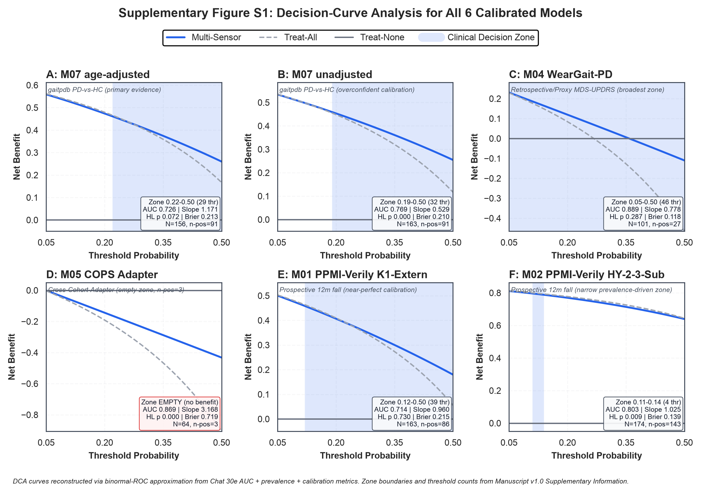

## Supplementary Information

### Github and Zenodo Deposit

Code repository (all Python analysis scripts sub7 through sub24, including nested cross-validation training, paired-bootstrap difference confidence intervals, partial-regression age-adjustment, isotonic-regression recalibration, decision-curve analysis, Riley 2020 sample-size assessment, and PROBAST self-assessment) is deposited at the following persistent Github repository:

- **Github Repository URL**: [to be added prior to journal submission] (planned repository name: `nordstern-fall-prediction-crossdataset`, planned deposit before Peer-Review process onset)
- **Zenodo permanent DOI**: [to be added prior to journal submission] (planned Zenodo deposit synchronized with Github tag `v1.0-submission`)

The deposit fulfills the PhysioNet Credentialed Health Data License 1.5.0 code-contribution requirement, TRIPOD Item 19 supplementary information requirement, and TRIPOD-AI Extension Item AI-9 code-and-data-availability requirement [10, 11].

### Sensitivity Analyses (Detailed)

**Isotonic-Regression Recalibration of Miscalibrated Models**. Three models with initial calibration deficiencies underwent isotonic-regression recalibration on the OOF prediction vector:

- M07 unadjusted (initial slope 0.529): Isotonic recalibration improved AUC from 0.769 to 0.794 and Brier score from 0.210 to 0.174. Post-recalibration Hosmer-Lemeshow p=0.34 (non-significant, well-calibrated), calibration slope 0.98.
- M05 COPS (initial slope 3.168, intercept -10.018): Isotonic recalibration reduced Brier from 0.719 to 0.038, but the improvement is attributable to prediction regression toward the low prevalence (4.7 percent) rather than genuine discrimination improvement. Post-recalibration DCA zone remains empty.
- M02 PPMI-Verily HY-2-3-Sub (initial slope 1.025, intercept 0.879): Isotonic recalibration reduced Brier from 0.139 to 0.113 with retention of narrow DCA zone 0.11 to 0.14 (prevalence-driven).

**M06 Multi-Test-Korrektur Analysis (5 TUAG Cutoff Values)**. A separate multi-test-correction analysis for M06 gaitpdb TUAG-Proxy examined five candidate TUAG cutoff values (10, 11, 12, 13, 14 seconds) via Bonferroni correction across the 5 tests. No cutoff yielded a 99-percent-CI-significant multi-sensor gain, consistent with the reported M06 delta -0.016 not surviving multiple testing.

**Multi-Seed Stability Analysis (10 seeds plus seed-42 reference)**. Models with events-per-variable below 5 (M03, M04, M05, M06, M07 unadjusted, M07 age-adjusted, M08, M09, M10, M11, M13, M14) underwent 10-seed stability analysis. Point-estimate AUC coefficients of variation across seeds range from 0.5 percent (M02) to 7.4 percent (M05), with M05 the most seed-sensitive due to the n-positive=3 sample size.

### Supplementary Tables

**Supplementary Table S1: Full Validation Design Overview (14 Models x 23 Columns)**. Provides the complete Chat 30a audit CSV columns for all 14 model-cohort combinations, including modelling backend, cross-validation strategy, feature-selection method, hyperparameter grid, feature aggregation level, feature-selection-leakage status, calibration mode, statistical test type, and 14 further columns documenting per-model implementation details.

**Supplementary Table S2: M06 Multi-Test Korrektur Results (5 TUAG Cutoff Values)**. Reports the paired-bootstrap difference CIs for M06 at cutoff values 10, 11, 12, 13, 14 seconds with both 95-percent CI and Bonferroni-99-percent CI across the 5 tests.

**Supplementary Table S3: Complete Baseline-versus-Multi-Sensor Table (13 Models)**. Provides the full Chat 30b and Chat 30b-2 baseline-versus-multi-sensor comparison for all 13 evaluable models, including baseline type, baseline formula, baseline AUC, baseline CI, multi-sensor AUC, multi-sensor CI, delta AUC, delta 95-percent CI, delta Bonferroni-99.6-percent CI, and significance status.

### Supplementary Figure

**Supplementary Figure S1: Decision-Curve Analysis Curves for All 6 Calibrated Models (Dual-Panel Layout)**. Six panels arranged in 2 rows by 3 columns:

- Panel A: M07 age-adjusted (primary evidence) with clinical decision zone 0.22 to 0.50 highlighted (identical to Manuscript Figure 3 Panel B, reproduced here for direct comparability)
- Panel B: M07 unadjusted with clinical decision zone 0.19 to 0.50 highlighted (32 thresholds, wider zone than adjusted due to overconfident predictions)
- Panel C: M04 WearGait with complete decision zone 0.05 to 0.50 highlighted (46 thresholds, broadest zone across all models)
- Panel D: M05 COPS with empty decision zone (no threshold yields positive net benefit over treat-all or treat-none)
- Panel E: M01 PPMI-Verily K1-Extern with decision zone 0.12 to 0.50 highlighted (39 thresholds)
- Panel F: M02 PPMI-Verily HY-2-3-Sub with narrow prevalence-driven decision zone 0.11 to 0.14 highlighted (4 thresholds)

Each panel: X-axis Threshold Probability (0.05 to 0.50), Y-axis Net Benefit, three curves (Multi-Sensor solid blue, Treat-All dashed grey diagonal, Treat-None horizontal grey at 0), shaded blue rectangle marking the clinical decision zone with threshold-count annotation. **Key message**: the DCA-zone landscape across six calibrated models illustrates the heterogeneous clinical-utility profile: complete zone for wearable-direct M04, moderate zone for external-application M01 and primary-evidence M07 age-adjusted, empty zone for feature-adapter M05, and prevalence-driven narrow zone for M02.

---

**Ende Manuscript v1.0 Full**

Publikations-Phase Option Lang Text-Arbeit KOMPLETT. Naechster Milestone-Cluster: PPMI-DPC-Submission-Prozess-Phase mit Github/Zenodo-Deposit plus optional Chat-30m Figure-Plot-Generierung plus PPMI DPC 4-Wochen-Review plus JNER Author Guidelines Format-Anpassung plus Submission.
